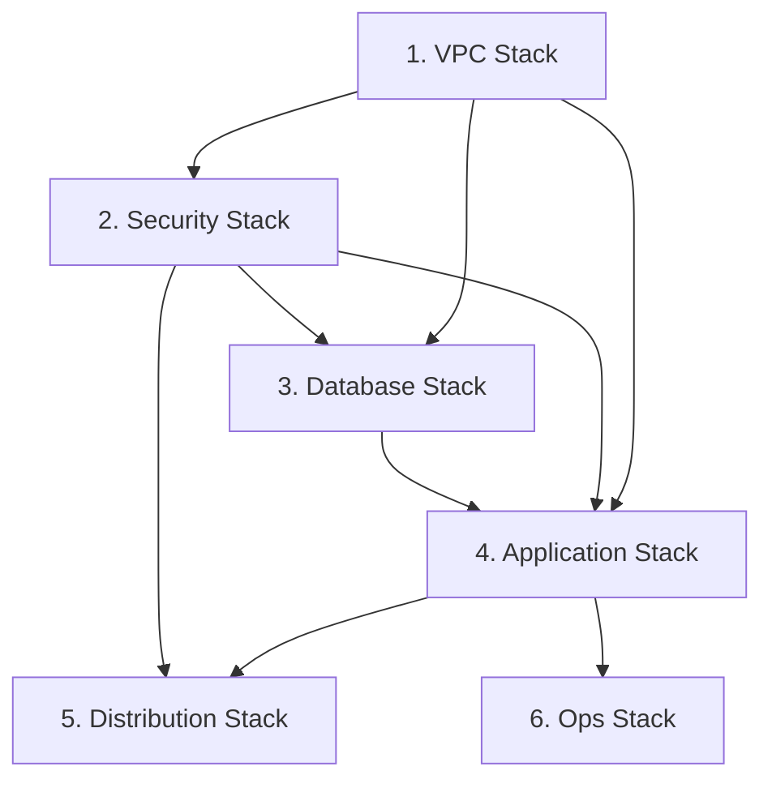

# AWS CDK サーバーレスWebサービスアーキテクチャ 設計

**作成日**: 2026-01-13
**関連要件定義**: [requirements.md](../../spec/aws-cdk-serverless-architecture/requirements.md)
**ヒアリング記録**: [design-interview.md](design-interview.md)

**【信頼性レベル凡例】**:
- 🔵 **青信号**: EARS要件定義書・設計文書・ユーザヒアリングを参考にした確実な設計
- 🟡 **黄信号**: EARS要件定義書・設計文書・ユーザヒアリングから妥当な推測による設計
- 🔴 **赤信号**: EARS要件定義書・設計文書・ユーザヒアリングにない推測による設計

---

## システム概要 🔵

**信頼性**: 🔵 *要件定義書・ユーザヒアリングより*

AWS CDK v2 (TypeScript) を使用して構築する高可用性・セキュリティ強化されたサーバーレスWebサービスアーキテクチャ。

**主要特徴**:
- ECS Fargate によるコンテナベースのアプリケーション実行
- Aurora MySQL Serverless v2 によるスケーラブルなデータベース
- CloudFront + ALB による高性能な配信とロードバランシング
- Sidecar パターンによるセキュアな DB 接続
- VPC Endpoint による内部通信最適化とコスト削減

---

## アーキテクチャパターン 🔵

**信頼性**: 🔵 *要件定義書・ユーザヒアリングより*

- **パターン**: Multi-Tier Serverless Architecture + Sidecar Pattern
- **選択理由**:
  - 高可用性: Multi-AZ 構成による冗長化
  - セキュリティ: VPC Endpoint、WAF、Sidecar パターン
  - コスト効率: Serverless (Fargate + Aurora Serverless v2) による従量課金
  - 運用効率: ECS Exec による運用操作、Container Insights によるモニタリング

---

## システム構成図 🔵

**信頼性**: 🔵 *要件定義書・ユーザヒアリングより*

```
                                    ┌─────────────────────────────────────────────────────────────┐
                                    │                        AWS Cloud                            │
┌─────────┐    ┌─────────────┐     │  ┌─────────────────────────────────────────────────────────┐ │
│         │    │             │     │  │                    CloudFront + WAF                     │ │
│  User   ├────►  CloudFront ├─────┼──►                                                         │ │
│         │    │  + WAF      │     │  │  - AWS Managed Rules (Common RuleSet, SQLi)            │ │
└─────────┘    └──────┬──────┘     │  │  - OAC for S3                                          │ │
                      │            │  └─────────────────────┬───────────────────────────────────┘ │
                      │            │                        │                                     │
                      │            │  ┌─────────────────────▼───────────────────────────────────┐ │
                      │            │  │                 VPC (10.0.0.0/16)                       │ │
                      │            │  │                                                         │ │
                      │            │  │  ┌───────────────────────────────────────────────────┐  │ │
                      │            │  │  │              Public Subnets (/24 x2)              │  │ │
                      │            │  │  │                                                   │  │ │
                      │            │  │  │  ┌─────────────────┐    ┌─────────────────────┐  │  │ │
                      │            │  │  │  │   ALB (80/443)  │    │  NAT Gateway x 2    │  │  │ │
                      └────────────┼──┼──┼──►   Internet-     │    │  (1 per AZ)         │  │  │ │
                                   │  │  │  │   facing        │    │                     │  │  │ │
                                   │  │  │  └────────┬────────┘    └─────────────────────┘  │  │ │
                                   │  │  └───────────┼──────────────────────────────────────┘  │ │
                                   │  │              │                                          │ │
                                   │  │  ┌───────────▼──────────────────────────────────────┐  │ │
                                   │  │  │           Private App Subnets (/23 x2)           │  │ │
                                   │  │  │                                                   │  │ │
                                   │  │  │  ┌─────────────────────────────────────────────┐ │  │ │
                                   │  │  │  │            ECS Fargate Cluster              │ │  │ │
                                   │  │  │  │                                             │ │  │ │
                                   │  │  │  │  ┌─────────────────┐ ┌─────────────────┐   │ │  │ │
                                   │  │  │  │  │ Frontend Svc    │ │ Backend Svc     │   │ │  │ │
                                   │  │  │  │  │ (SPA, x2 tasks) │ │ (REST API, x2)  │   │ │  │ │
                                   │  │  │  │  │                 │ │                 │   │ │  │ │
                                   │  │  │  │  │ ┌─────────────┐ │ │ ┌─────────────┐ │   │ │  │ │
                                   │  │  │  │  │ │ App         │ │ │ │ App         │ │   │ │  │ │
                                   │  │  │  │  │ │ Container   │ │ │ │ Container   │ │   │ │  │ │
                                   │  │  │  │  │ └─────────────┘ │ │ └─────────────┘ │   │ │  │ │
                                   │  │  │  │  │ ┌─────────────┐ │ │ ┌─────────────┐ │   │ │  │ │
                                   │  │  │  │  │ │ Sidecar     │ │ │ │ Sidecar     │ │   │ │  │ │
                                   │  │  │  │  │ │ (Alpine)    │ │ │ │ (Alpine)    │─┼───┼─┼──┼─┼─┐
                                   │  │  │  │  │ └─────────────┘ │ │ └─────────────┘ │   │ │  │ │ │
                                   │  │  │  │  └─────────────────┘ └─────────────────┘   │ │  │ │ │
                                   │  │  │  └─────────────────────────────────────────────┘ │  │ │ │
                                   │  │  └──────────────────────────────────────────────────┘  │ │ │
                                   │  │                                                         │ │ │
                                   │  │  ┌──────────────────────────────────────────────────┐  │ │ │
                                   │  │  │           Private DB Subnets (/24 x2)            │  │ │ │
                                   │  │  │                                                   │  │ │ │
                                   │  │  │  ┌─────────────────────────────────────────────┐ │  │ │ │
                                   │  │  │  │         Aurora MySQL Serverless v2          │◄┼──┼─┼─┘
                                   │  │  │  │                                             │ │  │ │
                                   │  │  │  │  - MinCapacity: 0.5 ACU                     │ │  │ │
                                   │  │  │  │  - MaxCapacity: 2 ACU                       │ │  │ │
                                   │  │  │  │  - Storage Encryption: Enabled              │ │  │ │
                                   │  │  │  │  - Auto Backup: Enabled                     │ │  │ │
                                   │  │  │  └─────────────────────────────────────────────┘ │  │ │
                                   │  │  └──────────────────────────────────────────────────┘  │ │
                                   │  │                                                         │ │
                                   │  │  ┌──────────────────────────────────────────────────┐  │ │
                                   │  │  │                  VPC Endpoints                   │  │ │
                                   │  │  │  - SSM (ssm, ssmmessages, ec2messages)           │  │ │
                                   │  │  │  - ECR (ecr.api, ecr.dkr)                        │  │ │
                                   │  │  │  - CloudWatch Logs (logs)                        │  │ │
                                   │  │  │  - S3 (Gateway Endpoint)                         │  │ │
                                   │  │  └──────────────────────────────────────────────────┘  │ │
                                   │  └─────────────────────────────────────────────────────────┘ │
                                   │                                                              │
                                   │  ┌──────────────────────────────────────────────────────────┐│
                                   │  │                   Supporting Services                    ││
                                   │  │                                                          ││
                                   │  │  ┌──────────────┐ ┌──────────────┐ ┌──────────────────┐ ││
                                   │  │  │   S3 Bucket  │ │  CloudWatch  │ │  Secrets Manager │ ││
                                   │  │  │  (Static +   │ │   Logs +     │ │  (DB Creds)      │ ││
                                   │  │  │   Sorry)     │ │   Alarms     │ │                  │ ││
                                   │  │  └──────────────┘ └───────┬──────┘ └──────────────────┘ ││
                                   │  │                           │                              ││
                                   │  │  ┌──────────────┐ ┌───────▼──────┐ ┌──────────────────┐ ││
                                   │  │  │     ACM      │ │ SNS + Chatbot│ │   CodePipeline   │ ││
                                   │  │  │  (SSL Cert)  │ │  → Slack     │ │   + CodeBuild    │ ││
                                   │  │  └──────────────┘ └──────────────┘ └──────────────────┘ ││
                                   │  └──────────────────────────────────────────────────────────┘│
                                   └──────────────────────────────────────────────────────────────┘
```

---

## CDK Stack 構成 🔵

**信頼性**: 🔵 *ユーザヒアリングより*

6つの CDK Stack に機能別分割：

```
aws-cdk-serverless-architecture/
├── bin/
│   └── app.ts                    # CDK App エントリーポイント
├── lib/
│   ├── stack/
│   │   ├── vpc-stack.ts          # 1. VPC Stack
│   │   ├── security-stack.ts     # 2. Security Stack
│   │   ├── database-stack.ts     # 3. Database Stack
│   │   ├── application-stack.ts  # 4. Application Stack
│   │   ├── distribution-stack.ts # 5. Distribution Stack
│   │   └── ops-stack.ts          # 6. Ops Stack
│   └── construct/
│       ├── vpc/
│       │   ├── vpc-construct.ts
│       │   └── endpoints-construct.ts
│       ├── ecs/
│       │   ├── cluster-construct.ts
│       │   ├── task-definition-construct.ts
│       │   └── service-construct.ts
│       ├── database/
│       │   └── aurora-construct.ts
│       ├── security/
│       │   ├── security-group-construct.ts
│       │   └── waf-construct.ts
│       └── monitoring/
│           ├── alarm-construct.ts
│           └── dashboard-construct.ts
├── lambda/
│   ├── log_processor/
│   │   └── index.py
│   └── custom_resource/
│       └── index.py
├── test/
│   └── *.test.ts
├── parameter.ts                   # 環境別パラメータ
├── cdk.json
├── package.json
└── tsconfig.json
```

### Stack 依存関係 🔵

**信頼性**: 🔵 *CDK ベストプラクティスより*



### 各 Stack の責務 🔵

**信頼性**: 🔵 *要件定義・ユーザヒアリングより*

| Stack | 責務 | 主要リソース |
|-------|------|-------------|
| VPC Stack | ネットワーク基盤 | VPC, Subnet, IGW, NAT, VPC Endpoints |
| Security Stack | セキュリティ | Security Groups, IAM Roles, WAF |
| Database Stack | データベース | Aurora Serverless v2, Secrets Manager |
| Application Stack | アプリケーション | ECS Cluster, Task Definition, Service, ALB |
| Distribution Stack | コンテンツ配信 | CloudFront, S3, OAC |
| Ops Stack | 運用・監視 | CloudWatch Logs/Alarms, Chatbot, CI/CD |

---

## コンポーネント構成

### ネットワーク層 🔵

**信頼性**: 🔵 *要件定義書 REQ-001〜011より*

| コンポーネント | 設定値 | 備考 |
|---------------|--------|------|
| VPC CIDR | 10.0.0.0/16 | 65,536 IPs |
| 可用性ゾーン | 2 (ap-northeast-1a, 1c) | Multi-AZ |
| Public Subnet | /24 x 2 | ALB, NAT Gateway |
| Private App Subnet | /23 x 2 | ECS Fargate |
| Private DB Subnet | /24 x 2 | Aurora |
| Internet Gateway | 1 | |
| NAT Gateway | 2 (1 per AZ) | 高可用性 |

### VPC Endpoints 🔵

**信頼性**: 🔵 *要件定義書 REQ-008〜011より*

| Endpoint | Type | 用途 |
|----------|------|------|
| ssm | Interface | SSM Session Manager |
| ssmmessages | Interface | SSM Session Manager |
| ec2messages | Interface | SSM Session Manager |
| ecr.api | Interface | ECR API |
| ecr.dkr | Interface | ECR Docker |
| logs | Interface | CloudWatch Logs |
| s3 | Gateway | S3 アクセス |

### コンピューティング層 🔵

**信頼性**: 🔵 *要件定義書 REQ-012〜021・ユーザヒアリングより*

#### ECS クラスター

| 設定項目 | 設定値 | 備考 |
|----------|--------|------|
| 起動タイプ | Fargate | サーバーレス |
| Container Insights | 有効 | モニタリング |

#### Task Definition (Frontend / Backend 共通)

| 設定項目 | 設定値 | 備考 |
|----------|--------|------|
| CPU | 512 (0.5 vCPU) | |
| Memory | 1024 (1 GB) | |
| App Container | アプリケーションイメージ | ECR から Pull |
| Sidecar Container | Alpine + socat | ポートフォワーディング |
| Task Role | AmazonSSMManagedInstanceCore | ECS Exec 用 |

#### ECS Service

| 設定項目 | 設定値 | 備考 |
|----------|--------|------|
| Desired Count | 2 | 高可用性 |
| enableExecuteCommand | true | ECS Exec |
| デプロイメント | Rolling Update | |

### データベース層 🔵

**信頼性**: 🔵 *要件定義書 REQ-022〜027・ユーザヒアリングより*

#### Aurora MySQL Serverless v2

| 設定項目 | 設定値 | 備考 |
|----------|--------|------|
| Engine | Aurora MySQL | |
| Mode | Serverless v2 | |
| MinCapacity | 0.5 ACU | コスト優先 |
| MaxCapacity | 2 ACU | コスト優先 |
| Storage Encryption | 有効 | |
| Auto Backup | 有効 | |
| Backup Retention | 7 日 🟡 | 標準設定（推測） |

### セキュリティ・配信層 🔵

**信頼性**: 🔵 *要件定義書 REQ-028〜034・ユーザヒアリングより*

#### ALB

| 設定項目 | 設定値 | 備考 |
|----------|--------|------|
| Scheme | Internet-facing | |
| Subnet | Public Subnet | |
| HTTP→HTTPS | リダイレクト | |
| SSL 証明書 | ACM | |

#### CloudFront

| 設定項目 | 設定値 | 備考 |
|----------|--------|------|
| Origin | S3 (OAC) + ALB | |
| Price Class | PriceClass_200 🟡 | 日本含むリージョン（推測） |
| Viewer Protocol | HTTPS Only | |

#### WAF

| 設定項目 | 設定値 | 備考 |
|----------|--------|------|
| 適用先 | CloudFront | |
| Managed Rules | AWSManagedRulesCommonRuleSet | |
| | AWSManagedRulesSQLiRuleSet | |

### 運用・監視層 🔵

**信頼性**: 🔵 *要件定義書 REQ-035〜041・ユーザヒアリングより*

#### CloudWatch Logs

| ログソース | 保持期間 (Dev) | 保持期間 (Prod) |
|-----------|---------------|-----------------|
| ECS | 3 日 | 30 日 → S3 Glacier |
| RDS | 3 日 | 30 日 → S3 Glacier |
| VPC Flow Logs | 3 日 | 30 日 → S3 Glacier |

#### CloudWatch Alarms 🔵

**信頼性**: 🔵 *ユーザヒアリングより*

| メトリクス | 閾値 | 備考 |
|-----------|------|------|
| ECS CPU Utilization | > 80% | |
| ECS Memory Utilization | > 80% | |
| CloudWatch Logs Error Pattern | > 0 | |

#### CI/CD 🔵

**信頼性**: 🔵 *ユーザヒアリングより*

| コンポーネント | 設定 |
|---------------|------|
| Source | CodeCommit |
| Build | CodeBuild |
| Deploy | CodePipeline → ECS |

---

## 環境構成 🔵

**信頼性**: 🔵 *ユーザヒアリングより*

### parameter.ts による環境別設定

```typescript
// parameter.ts の構造（概要）
export interface EnvironmentConfig {
  envName: string;
  account: string;
  region: string;

  // ネットワーク
  vpcCidr: string;

  // ECS
  taskCpu: number;
  taskMemory: number;
  desiredCount: number;

  // Aurora
  auroraMinCapacity: number;
  auroraMaxCapacity: number;

  // ログ
  logRetentionDays: number;

  // 監視
  slackWorkspaceId: string;
  slackChannelId: string;
}

export const devConfig: EnvironmentConfig = { /* ... */ };
export const prodConfig: EnvironmentConfig = { /* ... */ };
```

---

## 非機能要件の実現方法

### パフォーマンス 🔵

**信頼性**: 🔵 *要件定義書 NFR-001〜004より*

- **高可用性**: Multi-AZ 構成、NAT Gateway 各 AZ 配置、ECS Desired Count 2
- **レイテンシ最適化**: VPC Endpoint 使用、CloudFront によるキャッシング
- **スケーラビリティ**: Aurora Serverless v2 による自動スケーリング

### セキュリティ 🔵

**信頼性**: 🔵 *要件定義書 NFR-101〜105より*

- **ネットワーク分離**: VPC Endpoint による AWS 内部通信
- **データ暗号化**: Aurora Storage Encryption
- **Web 保護**: WAF (AWS Managed Rules)
- **アクセス制御**: OAC による S3 保護、Security Group による最小権限
- **HTTPS 強制**: ALB リダイレクト

### コスト最適化 🔵

**信頼性**: 🔵 *要件定義書 NFR-201〜202・ユーザヒアリングより*

- **NAT 費用削減**: VPC Endpoint 使用
- **DB 費用最適化**: Aurora Serverless v2 (MinCapacity: 0.5 ACU)
- **コンピューティング**: Fargate による従量課金

### 運用性 🔵

**信頼性**: 🔵 *要件定義書 NFR-301〜303より*

- **モニタリング**: Container Insights、CloudWatch Logs/Alarms
- **運用操作**: ECS Exec (enableExecuteCommand)
- **セキュア接続**: Sidecar パターンによる DB 接続

---

## 技術的制約 🔵

**信頼性**: 🔵 *要件定義書 REQ-401〜405より*

### 必須制約

| 項目 | 制約内容 |
|------|----------|
| IaC | AWS CDK v2 (TypeScript) |
| Lambda ランタイム | Python 3.x |
| リージョン | ap-northeast-1 (Tokyo) |
| DB アクセス | 外部からの直接アクセス禁止 |
| AWS サービス通信 | VPC Endpoint 経由 |

### パフォーマンス制約 🟡

**信頼性**: 🟡 *ECS/Aurora 仕様から妥当な推測*

| 項目 | 制約内容 |
|------|----------|
| ECS タスク | 0.5 vCPU / 1 GB Memory |
| Aurora | 0.5 - 2 ACU |

### セキュリティ制約 🔵

**信頼性**: 🔵 *要件定義書より*

| 項目 | 制約内容 |
|------|----------|
| DB 暗号化 | Storage Encryption 必須 |
| Web 保護 | WAF 必須 |
| HTTPS | 強制 |

---

## 関連文書

- **データフロー**: [dataflow.md](dataflow.md)
- **型定義**: [interfaces.ts](interfaces.ts)
- **DBスキーマ**: [database-schema.sql](database-schema.sql)（アプリケーション設計時に作成）
- **設計ヒアリング**: [design-interview.md](design-interview.md)
- **要件定義**: [requirements.md](../../spec/aws-cdk-serverless-architecture/requirements.md)

---

## 信頼性レベルサマリー

- 🔵 青信号: 28件 (90%)
- 🟡 黄信号: 3件 (10%)
- 🔴 赤信号: 0件 (0%)

**品質評価**: ✅ 高品質 - 設計の大部分が要件定義書・ユーザヒアリングにより確認済み
