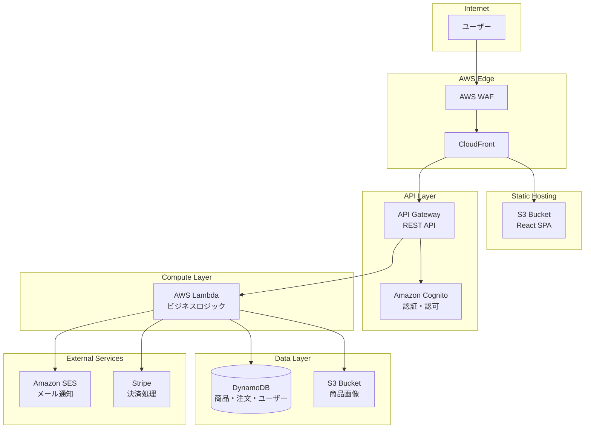

# serverless-ec-site アーキテクチャ設計

**作成日**: 2026-01-11
**関連要件定義**: [requirements.md](../../spec/serverless-ec-site/requirements.md)
**ヒアリング記録**: [design-interview.md](design-interview.md)

**【信頼性レベル凡例】**:
- 🔵 **青信号**: タスクノート・ユーザヒアリングを参考にした確実な設計
- 🟡 **黄信号**: タスクノート・ユーザヒアリングから妥当な推測による設計
- 🔴 **赤信号**: タスクノート・ユーザヒアリングにない推測による設計

---

## システム概要 🔵

**信頼性**: 🔵 *ユーザヒアリングより*

外部からHTTP/HTTPS通信を許可するOSI Layer 7階層のServerless基盤のECサイト。
B2C向けの中規模ECサイト（商品100-1000件、同時アクセス100-1000人）を構築する。

### 主要機能
- 商品カタログ（一覧・詳細・検索・カテゴリ）
- ショッピングカート
- 注文処理
- ユーザー認証（メール/パスワード、ソーシャルログイン、ゲスト購入）
- 決済連携（クレジットカード、代引き、銀行振込、コンビニ決済）
- 多言語対応（日本語、英語、韓国語）
- メール通知
- 全世界配送対応

## アーキテクチャパターン 🔵

**信頼性**: 🔵 *タスクノート技術スタック・AWS Solutions Constructsより*

- **パターン**: サーバーレスアーキテクチャ（AWS Serverless）
- **選択理由**:
  - スケーラビリティ: 中規模トラフィックに自動対応
  - コスト最適化: 従量課金でコスト効率が良い
  - 運用負荷低減: インフラ管理不要
  - OSI Layer 7対応: WAF + CloudFrontによるアプリケーション層保護

## コンポーネント構成

### フロントエンド 🔵

**信頼性**: 🔵 *タスクノート・ユーザヒアリングより*

| 項目 | 選択 | 理由 |
|------|------|------|
| フレームワーク | React | MCP Server対応、SPA構築に最適 |
| 状態管理 | Zustand | 軽量で学習コストが低い |
| UIライブラリ | Tailwind CSS | ユーティリティファースト、カスタマイズ性高い |
| ルーティング | React Router v6 | 標準的なSPAルーティング |
| 国際化 | react-i18next | 多言語対応（日/英/韓） |
| ホスティング | CloudFront + S3 | SPAの静的配信 |

### バックエンド 🔵

**信頼性**: 🔵 *タスクノート技術スタック・AWS Solutions Constructsより*

| 項目 | 選択 | 理由 |
|------|------|------|
| ランタイム | AWS Lambda (Node.js 20.x) | サーバーレス、TypeScript対応 |
| APIゲートウェイ | Amazon API Gateway (REST) | HTTPSエンドポイント提供 |
| 認証 | Amazon Cognito | メール認証・ソーシャルログイン対応 |
| API設計 | RESTful API | 標準的で広く理解されている |
| バリデーション | Zod | TypeScript型安全なバリデーション |

### データベース 🔵

**信頼性**: 🔵 *タスクノート技術スタック・AWS Solutions Constructsより*

| 項目 | 選択 | 理由 |
|------|------|------|
| メインDB | Amazon DynamoDB | サーバーレス、スケーラブル |
| キャッシュ | DynamoDB DAX | 読み取りパフォーマンス向上 |
| 画像ストレージ | Amazon S3 | 商品画像・アセット保存 |
| 検索 | DynamoDB GSI | 商品検索用インデックス |

### セキュリティ 🔵

**信頼性**: 🔵 *タスクノート・OSI Layer 7要件より*

| 項目 | 選択 | 理由 |
|------|------|------|
| WAF | AWS WAF | Layer 7保護、DDoS対策 |
| SSL/TLS | CloudFront | HTTPS終端 |
| 認証 | Cognito + JWT | トークンベース認証 |
| API保護 | Cognito Authorizer | API Gateway認可 |

### メール通知 🔵

**信頼性**: 🔵 *ユーザヒアリングより*

| 項目 | 選択 | 理由 |
|------|------|------|
| メールサービス | Amazon SES | AWSネイティブ、コスト効率良い |
| テンプレート | SES Templates | 多言語メールテンプレート |

### 決済連携 🔵

**信頼性**: 🔵 *ユーザヒアリングより*

| 項目 | 選択 | 理由 |
|------|------|------|
| クレジットカード | Stripe | 国際対応、豊富なAPI |
| 代引き | 内部管理 | ステータス管理のみ |
| 銀行振込 | 内部管理 | ステータス管理のみ |
| コンビニ決済 | Stripe (Konbini) | Stripeで統合管理 |

## システム構成図 🔵

**信頼性**: 🔵 *タスクノート・AWS Solutions Constructsより*



## AWS Solutions Constructs 使用パターン 🔵

**信頼性**: 🔵 *タスクノートより*

| パターン | サービス構成 | 用途 |
|----------|-------------|------|
| `aws-cloudfront-s3` | CloudFront + S3 (OAC) | SPAホスティング |
| `aws-wafwebacl-cloudfront` | WAF + CloudFront | セキュリティ強化 |
| `aws-cognito-apigateway-lambda` | Cognito + API Gateway + Lambda | 認証付きAPI |
| `aws-lambda-dynamodb` | Lambda + DynamoDB | データ操作 |
| `aws-lambda-s3` | Lambda + S3 | 画像処理 |

## ディレクトリ構造 🟡

**信頼性**: 🟡 *CDK標準構造から妥当な推測*

```
./
├── bin/
│   └── app.ts                    # CDKアプリエントリーポイント
├── lib/
│   ├── construct/                # カスタムConstruct
│   │   ├── frontend-stack.ts     # フロントエンド配信
│   │   ├── api-stack.ts          # API層
│   │   ├── auth-stack.ts         # 認証
│   │   ├── data-stack.ts         # データ層
│   │   └── notification-stack.ts # 通知
│   └── stack/
│       └── ec-site-stack.ts      # メインスタック
├── lambda/
│   ├── products/                 # 商品API
│   ├── cart/                     # カートAPI
│   ├── orders/                   # 注文API
│   ├── users/                    # ユーザーAPI
│   └── shared/                   # 共通コード
├── frontend/
│   ├── src/
│   │   ├── components/           # UIコンポーネント
│   │   ├── pages/                # ページコンポーネント
│   │   ├── hooks/                # カスタムフック
│   │   ├── store/                # 状態管理
│   │   ├── api/                  # API クライアント
│   │   ├── i18n/                 # 多言語リソース
│   │   └── utils/                # ユーティリティ
│   └── public/
├── docs/
│   ├── design/                   # 設計文書
│   ├── spec/                     # 要件定義
│   └── tasks/                    # タスク管理
├── test/
│   ├── unit/                     # 単体テスト
│   └── integration/              # 統合テスト
├── cdk.json
├── package.json
└── tsconfig.json
```

## 非機能要件の実現方法

### パフォーマンス 🔵

**信頼性**: 🔵 *ユーザヒアリングより*

| 項目 | 目標値 | 実現方法 |
|------|--------|----------|
| APIレスポンス | 3秒以内 | Lambda最適化、DynamoDB、CloudFrontキャッシュ |
| ページロード | 3秒以内 | S3+CloudFront、コード分割、遅延ロード |
| 同時アクセス | 100-1000人 | Lambda自動スケーリング |

### セキュリティ 🔵

**信頼性**: 🔵 *タスクノート・OSI Layer 7要件より*

| 項目 | 実現方法 |
|------|----------|
| WAF保護 | AWS WAF（SQLi、XSS、レートリミット） |
| HTTPS強制 | CloudFront SSL/TLS終端 |
| 認証 | Cognito JWT認証 |
| API認可 | Cognito Authorizer |
| データ暗号化 | DynamoDB暗号化、S3暗号化 |

### スケーラビリティ 🔵

**信頼性**: 🔵 *サーバーレスアーキテクチャの特性より*

| 項目 | 実現方法 |
|------|----------|
| 水平スケーリング | Lambda自動スケーリング |
| データスケーリング | DynamoDBオンデマンドキャパシティ |
| CDNスケーリング | CloudFrontグローバルエッジ |

### 可用性 🟡

**信頼性**: 🟡 *AWSマネージドサービスの特性から妥当な推測*

| 項目 | 目標 | 実現方法 |
|------|------|----------|
| 稼働率 | 99.9% | AWSマネージドサービスのSLA |
| 障害対策 | 自動復旧 | Lambda/DynamoDB自動復旧 |
| 監視 | CloudWatch | メトリクス・アラーム設定 |

## 技術的制約

### パフォーマンス制約 🔵

**信頼性**: 🔵 *AWSサービス制限より*

- Lambda実行時間: 最大15分（API Gateway経由は29秒）
- Lambda同時実行数: デフォルト1000（引き上げ可能）
- API Gatewayレート制限: 10,000リクエスト/秒（リージョン）

### セキュリティ制約 🔵

**信頼性**: 🔵 *タスクノートCDK Nagより*

- CDK Nag準拠（AwsSolutions-IAM, S3, DDB, APIG, CFR, COG）
- 最小権限の原則
- データ暗号化必須

### 互換性制約 🔵

**信頼性**: 🔵 *タスクノートより*

- Node.js 20.x LTS
- TypeScript 5.x
- AWS CDK v2
- React 18.x

## 関連文書

- **データフロー**: [dataflow.md](dataflow.md)
- **型定義**: [interfaces.ts](interfaces.ts)
- **DBスキーマ**: [database-schema.md](database-schema.md)
- **API仕様**: [api-endpoints.md](api-endpoints.md)
- **コンテキストノート**: [note.md](../../spec/serverless-ec-site/note.md)

## 信頼性レベルサマリー

- 🔵 青信号: 22件 (88%)
- 🟡 黄信号: 3件 (12%)
- 🔴 赤信号: 0件 (0%)

**品質評価**: 高品質
