# serverless-ec-site データフロー図

**作成日**: 2026-01-11
**関連アーキテクチャ**: [architecture.md](architecture.md)
**関連要件定義**: [requirements.md](../../spec/serverless-ec-site/requirements.md)

**【信頼性レベル凡例】**:
- 🔵 **青信号**: タスクノート・ユーザヒアリングを参考にした確実なフロー
- 🟡 **黄信号**: タスクノート・ユーザヒアリングから妥当な推測によるフロー
- 🔴 **赤信号**: タスクノート・ユーザヒアリングにない推測によるフロー

---

## システム全体のデータフロー 🔵

**信頼性**: 🔵 *アーキテクチャ設計より*

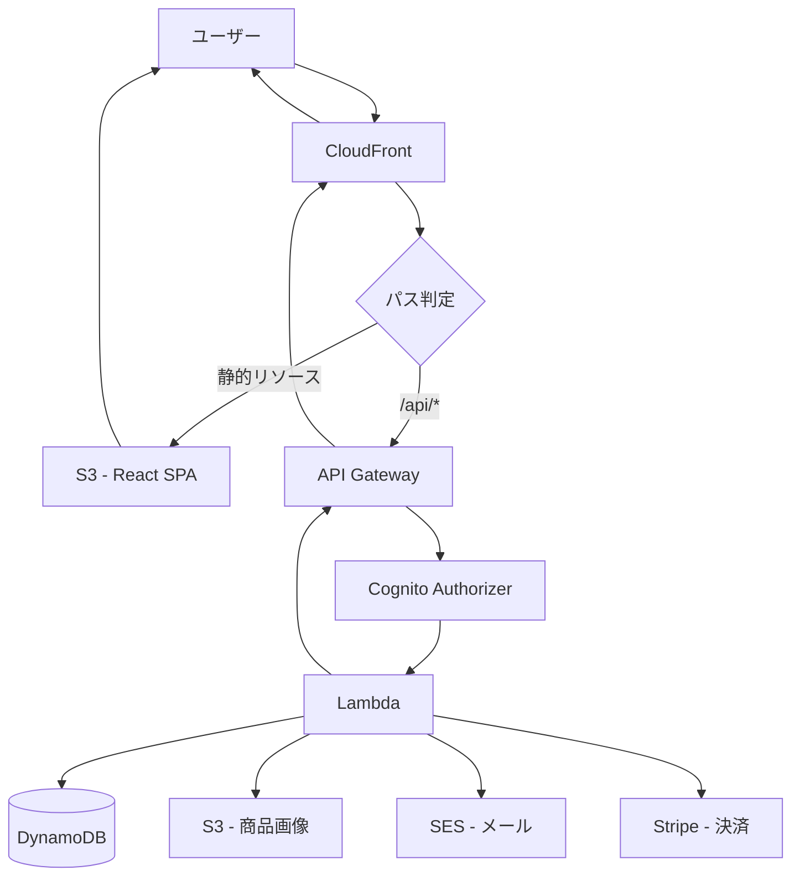

## 主要機能のデータフロー

### 機能1: ユーザー認証（会員登録） 🔵

**信頼性**: 🔵 *ユーザヒアリング（メール/パスワード認証）より*

**関連要件**: 認証機能

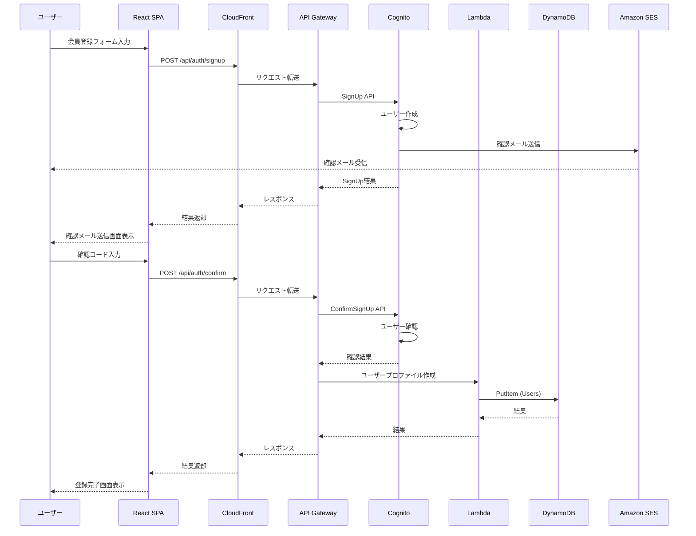

**詳細ステップ**:
1. ユーザーがメールアドレス・パスワードを入力
2. Cognitoでユーザー作成、確認メール送信
3. ユーザーが確認コード入力で認証完了
4. DynamoDBにユーザープロファイル作成

### 機能2: ユーザー認証（ログイン） 🔵

**信頼性**: 🔵 *ユーザヒアリングより*

**関連要件**: 認証機能

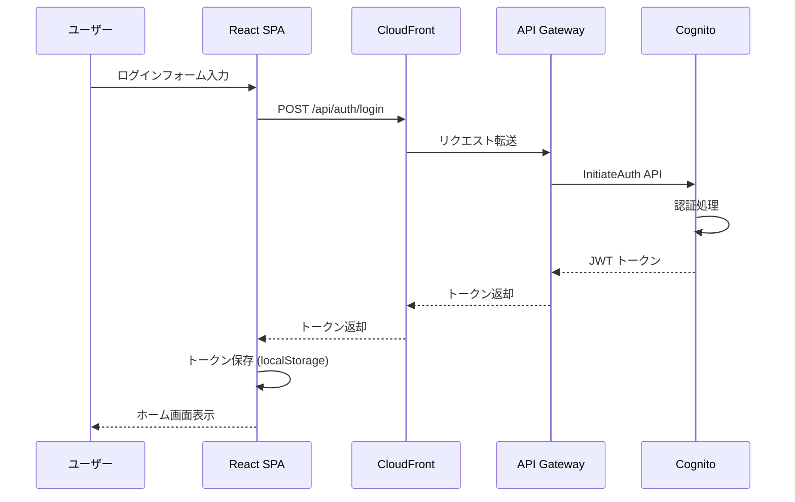

### 機能3: ソーシャルログイン（Google） 🔵

**信頼性**: 🔵 *ユーザヒアリング（ソーシャルログイン）より*

**関連要件**: 認証機能

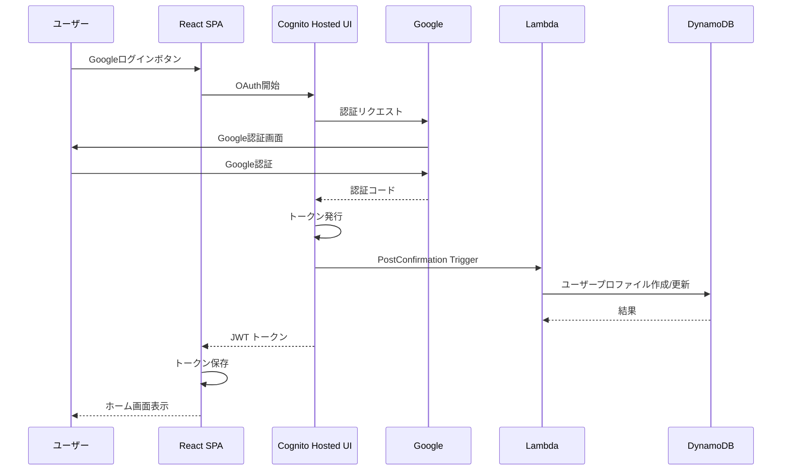

### 機能4: 商品一覧取得 🔵

**信頼性**: 🔵 *ユーザヒアリング（商品カタログ）より*

**関連要件**: 商品カタログ

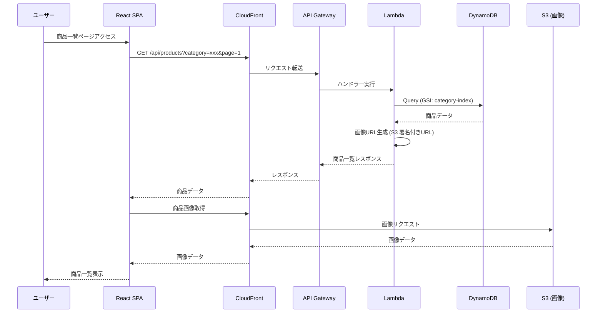

### 機能5: 商品検索 🔵

**信頼性**: 🔵 *ユーザヒアリング（商品カタログ）より*

**関連要件**: 商品カタログ

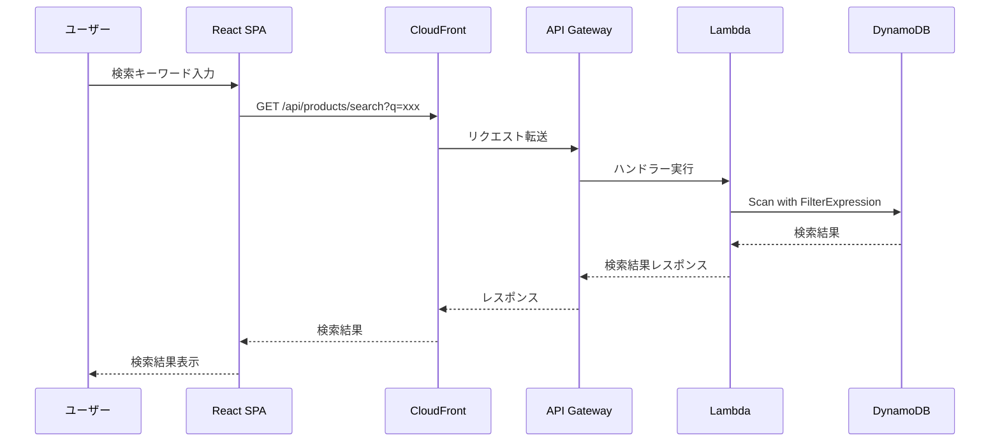

### 機能6: カートに追加 🔵

**信頼性**: 🔵 *ユーザヒアリング（カート・注文）より*

**関連要件**: ショッピングカート

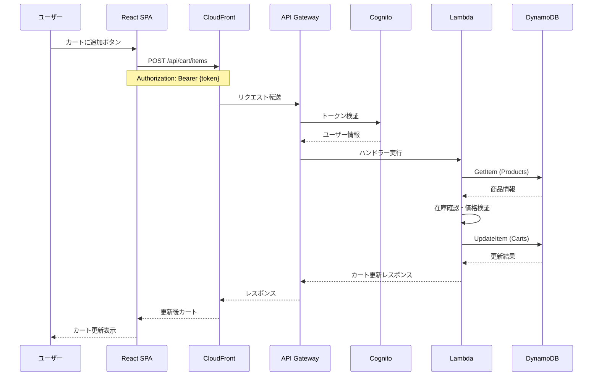

### 機能7: ゲストカート 🔵

**信頼性**: 🔵 *ユーザヒアリング（ゲスト購入）より*

**関連要件**: ショッピングカート

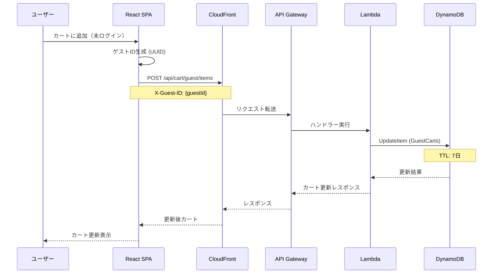

### 機能8: 注文作成 🔵

**信頼性**: 🔵 *ユーザヒアリング（カート・注文）より*

**関連要件**: 注文処理

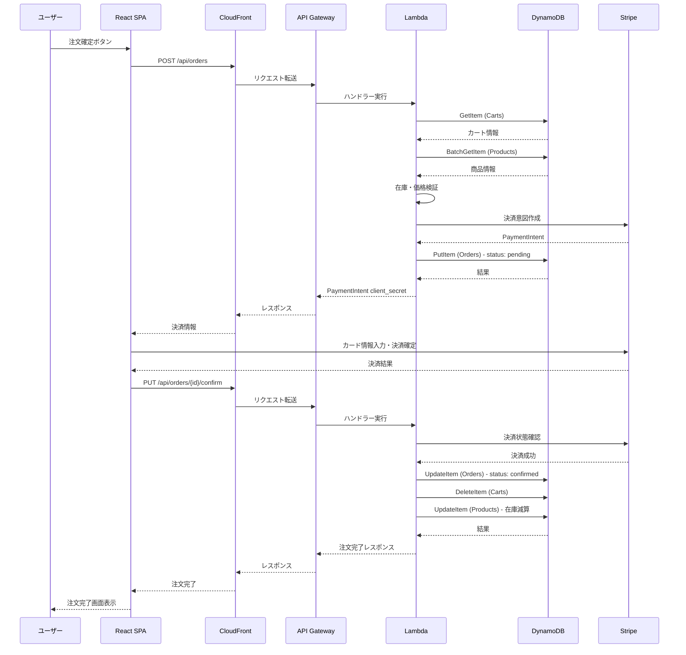

### 機能9: 代引き/銀行振込注文 🔵

**信頼性**: 🔵 *ユーザヒアリング（決済方法）より*

**関連要件**: 決済連携

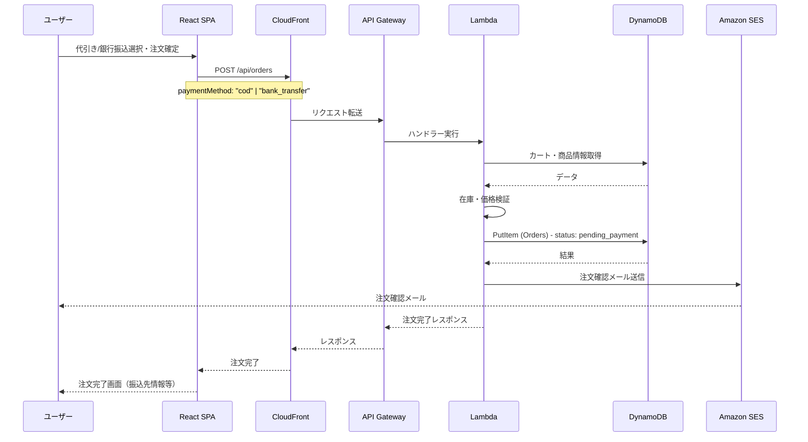

### 機能10: メール通知 🔵

**信頼性**: 🔵 *ユーザヒアリング（メール通知）より*

**関連要件**: メール通知

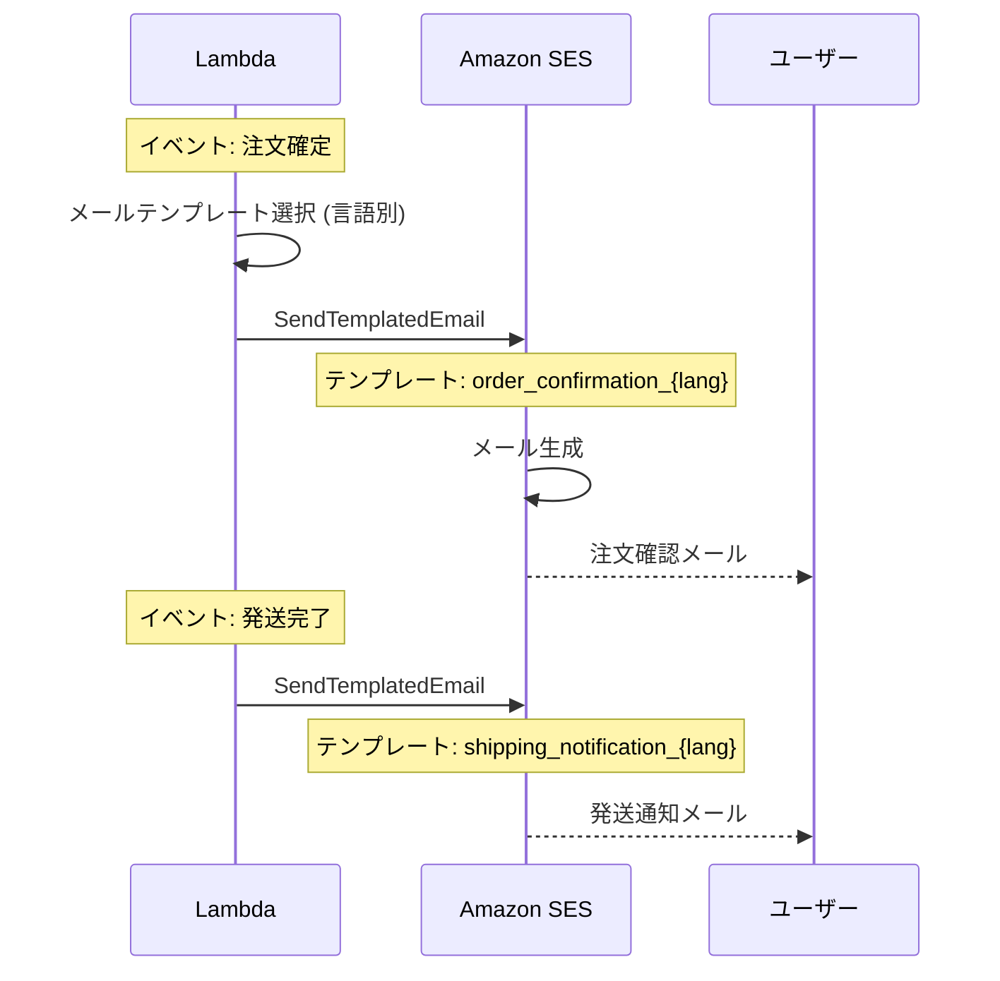

## データ処理パターン

### 同期処理 🔵

**信頼性**: 🔵 *アーキテクチャ設計より*

| 機能 | 理由 |
|------|------|
| 商品一覧・詳細取得 | 即時レスポンス必要 |
| カート操作 | リアルタイム反映必要 |
| 注文作成 | 決済連携必要 |
| ログイン・認証 | 即時レスポンス必要 |

### 非同期処理 🟡

**信頼性**: 🟡 *一般的なECサイトパターンから妥当な推測*

| 機能 | 理由 |
|------|------|
| メール送信 | 即時性不要、信頼性重視 |
| 在庫更新通知 | バックグラウンド処理 |
| 画像リサイズ | 重い処理 |

### バッチ処理 🟡

**信頼性**: 🟡 *一般的なECサイトパターンから妥当な推測*

| 機能 | 理由 |
|------|------|
| 売上レポート | 日次集計 |
| ゲストカート削除 | TTL + EventBridge |

## エラーハンドリングフロー 🟡

**信頼性**: 🟡 *一般的なパターンから妥当な推測*

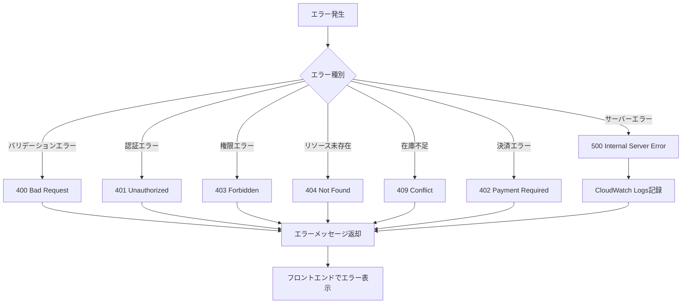

## 状態管理フロー

### フロントエンド状態管理 🟡

**信頼性**: 🟡 *Zustand選択から妥当な推測*

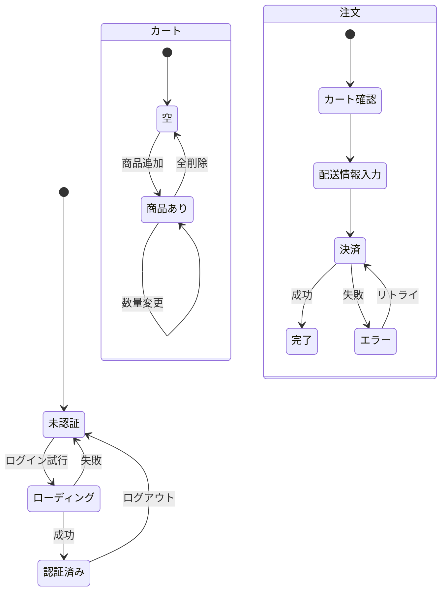

### 注文状態管理 🔵

**信頼性**: 🔵 *ユーザヒアリング（決済方法・注文）より*

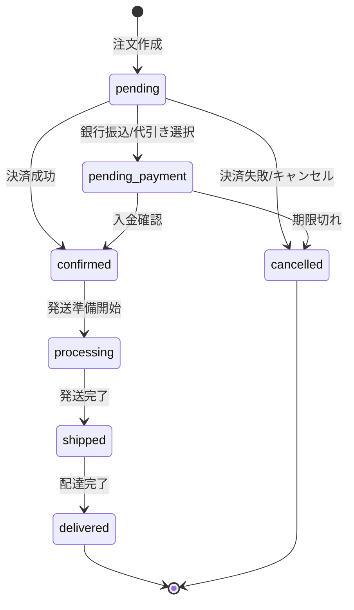

## データ整合性の保証 🟡

**信頼性**: 🟡 *DynamoDBの特性から妥当な推測*

| 項目 | 実現方法 |
|------|----------|
| トランザクション | DynamoDB TransactWriteItems |
| 在庫管理 | 条件付き更新（ConditionExpression） |
| 楽観的ロック | バージョン属性による制御 |
| 冪等性 | リクエストIDによる重複排除 |

## 関連文書

- **アーキテクチャ**: [architecture.md](architecture.md)
- **型定義**: [interfaces.ts](interfaces.ts)
- **DBスキーマ**: [database-schema.md](database-schema.md)
- **API仕様**: [api-endpoints.md](api-endpoints.md)

## 信頼性レベルサマリー

- 🔵 青信号: 14件 (74%)
- 🟡 黄信号: 5件 (26%)
- 🔴 赤信号: 0件 (0%)

**品質評価**: 高品質
