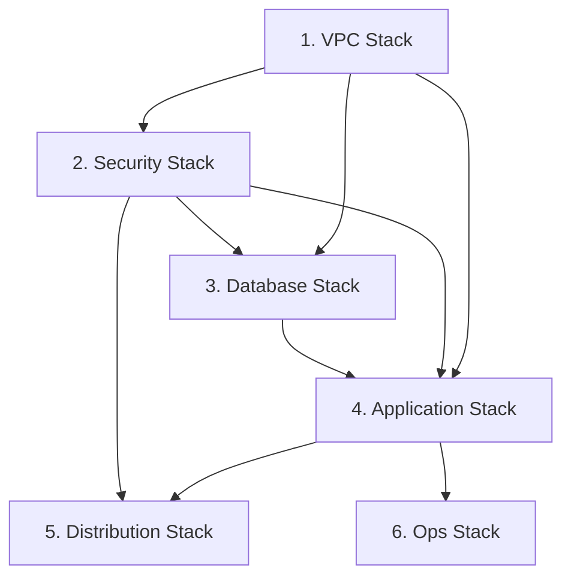

# TASK-0004: VPC Stack 統合 - TDD開発ノート

**タスクID**: TASK-0004
**タスクタイプ**: TDD
**推定工数**: 4時間
**フェーズ**: Phase 1 - 基盤構築

---

## 1. 技術スタック

### 使用技術・フレームワーク

| カテゴリ | 技術 | バージョン |
|---------|------|-----------|
| IaC | AWS CDK | v2.213.0 |
| 言語 | TypeScript | ~5.6.3 |
| テスト | Jest | ^29.7.0 |
| ランタイム | Node.js | ES2018 Target |

### アーキテクチャパターン

- **パターン**: Multi-Tier Serverless Architecture
- **ネットワーク構成**: 3層サブネット構成 (Public / Private App / Private DB)
- **通信最適化**: VPC Endpoint 経由で AWS サービスにアクセス
- **可用性**: Multi-AZ (ap-northeast-1a, ap-northeast-1c)

### 主要CDKモジュール

```typescript
import * as cdk from 'aws-cdk-lib';
import * as ec2 from 'aws-cdk-lib/aws-ec2';
import { Construct } from 'constructs';
import { VpcConstruct } from '../construct/vpc/vpc-construct';
import { EndpointsConstruct } from '../construct/vpc/endpoints-construct';
import { EnvironmentConfig } from '../../parameter';
```

**参照元**:
- `infra/package.json`
- `infra/tsconfig.json`
- `docs/design/aws-cdk-serverless-architecture/architecture.md`

---

## 2. 開発ルール

### プロジェクト固有ルール

1. **CDKコマンド実行**: `npx` を使用してワークスペースローカルのCDKバージョンを使用
2. **パラメータ管理**: `parameter.ts` で環境別設定を管理
3. **スタック分割**: 機能別に6つのスタックに分割
4. **テスト方式**: Jest スナップショットテスト

### コーディング規約

| 項目 | 規約 |
|------|------|
| ファイル命名 | kebab-case (例: `vpc-stack.ts`) |
| クラス命名 | PascalCase (例: `VpcStack`) |
| インターフェース | 型定義ファイルで一元管理 |
| エクスポート | Named Export を使用 |

### ディレクトリ構造

```
infra/
├── bin/
│   └── infra.ts              # CDK App エントリーポイント
├── lib/
│   ├── stack/                # Stack 定義
│   │   └── vpc-stack.ts      # 実装対象
│   └── construct/            # Construct 定義
│       └── vpc/
│           ├── vpc-construct.ts      # 依存先（TASK-0002 完了）
│           └── endpoints-construct.ts # 依存先（TASK-0003 完了）
├── test/
│   ├── construct/vpc/
│   │   ├── vpc-construct.test.ts
│   │   └── endpoints-construct.test.ts
│   └── vpc-stack.test.ts     # テストファイル（実装対象）
└── parameter.ts              # 環境別パラメータ
```

**参照元**:
- `CLAUDE.md`
- `docs/design/aws-cdk-serverless-architecture/architecture.md`

---

## 3. 関連実装

### 既存コード（依存先）

| ファイル | 内容 | 状態 |
|---------|------|------|
| `infra/lib/construct/vpc/vpc-construct.ts` | VPC Construct 実装 | 完了 |
| `infra/lib/construct/vpc/endpoints-construct.ts` | VPC Endpoints Construct 実装 | 完了 |
| `infra/parameter.ts` | 環境別パラメータ設定 | 完了 |
| `infra/bin/infra.ts` | CDK Appエントリーポイント | 要更新 |

### VpcConstruct インターフェース

```typescript
// infra/lib/construct/vpc/vpc-construct.ts より
export class VpcConstruct extends Construct {
  public readonly vpc: ec2.IVpc;               // VPC への参照
  public readonly publicSubnets: ec2.ISubnet[];     // Public Subnet 配列
  public readonly privateAppSubnets: ec2.ISubnet[]; // Private App Subnet 配列
  public readonly privateDbSubnets: ec2.ISubnet[];  // Private DB Subnet 配列
}

export interface VpcConstructProps {
  readonly vpcCidr?: string;           // default: '10.0.0.0/16'
  readonly maxAzs?: number;            // default: 2
  readonly natGateways?: number;       // default: 2
  readonly publicSubnetCidrMask?: number;      // default: 24
  readonly privateAppSubnetCidrMask?: number;  // default: 23
  readonly privateDbSubnetCidrMask?: number;   // default: 24
}
```

### EndpointsConstruct インターフェース

```typescript
// infra/lib/construct/vpc/endpoints-construct.ts より
export class EndpointsConstruct extends Construct {
  public readonly ssmEndpoint?: ec2.IInterfaceVpcEndpoint;
  public readonly ssmMessagesEndpoint?: ec2.IInterfaceVpcEndpoint;
  public readonly ec2MessagesEndpoint?: ec2.IInterfaceVpcEndpoint;
  public readonly ecrApiEndpoint?: ec2.IInterfaceVpcEndpoint;
  public readonly ecrDkrEndpoint?: ec2.IInterfaceVpcEndpoint;
  public readonly logsEndpoint?: ec2.IInterfaceVpcEndpoint;
  public readonly s3Endpoint?: ec2.IGatewayVpcEndpoint;
}

export interface EndpointsConstructProps {
  readonly vpc: ec2.IVpc;           // VPC への参照（必須）
  readonly enableSsm?: boolean;     // default: true
  readonly enableEcr?: boolean;     // default: true
  readonly enableLogs?: boolean;    // default: true
  readonly enableS3?: boolean;      // default: true
}
```

### EnvironmentConfig インターフェース

```typescript
// infra/parameter.ts より
export interface EnvironmentConfig {
  envName: string;
  account: string;
  region: string;
  vpcCidr: string;
  taskCpu: number;
  taskMemory: number;
  desiredCount: number;
  auroraMinCapacity: number;
  auroraMaxCapacity: number;
  logRetentionDays: number;
  slackWorkspaceId: string;
  slackChannelId: string;
}

export const devConfig: EnvironmentConfig = {
  envName: 'dev',
  region: 'ap-northeast-1',
  vpcCidr: '10.0.0.0/16',
  // ...
};

export const prodConfig: EnvironmentConfig = {
  envName: 'prod',
  region: 'ap-northeast-1',
  vpcCidr: '10.0.0.0/16',
  // ...
};
```

**参照元**:
- `infra/lib/construct/vpc/vpc-construct.ts`
- `infra/lib/construct/vpc/endpoints-construct.ts`
- `infra/parameter.ts`
- `docs/tasks/aws-cdk-serverless-architecture/TASK-0002.md`
- `docs/tasks/aws-cdk-serverless-architecture/TASK-0003.md`

---

## 4. 設計文書

### アーキテクチャ仕様

#### VPC Stack の責務 🔵

**信頼性**: 🔵 *設計文書より*

| 責務 | 内容 |
|------|------|
| ネットワーク基盤 | VPC, Subnet, IGW, NAT, VPC Endpoints |
| Stack 間連携 | 他 Stack へ VPC リソースを公開 |

#### VPC Stack が公開するプロパティ 🔵

**信頼性**: 🔵 *CDK ベストプラクティスより*

| プロパティ | 型 | 用途 |
|-----------|-----|------|
| vpc | ec2.IVpc | VPC 参照 |
| publicSubnets | ec2.ISubnet[] | ALB 配置用 |
| privateAppSubnets | ec2.ISubnet[] | ECS 配置用 |
| privateDbSubnets | ec2.ISubnet[] | Aurora 配置用 |

#### Stack 依存関係図



### 関連要件 (REQ)

| 要件ID | 内容 | 信頼性 |
|--------|------|--------|
| REQ-001 | CIDR Block `10.0.0.0/16` の VPC 作成 | 🔵 |
| REQ-002 | 2つの AZ で Multi-AZ 構成 | 🔵 |
| REQ-003 | Public Subnet を `/24` で割り当て | 🔵 |
| REQ-004 | Private App Subnet を `/23` で割り当て | 🔵 |
| REQ-005 | Private DB Subnet を `/24` で割り当て | 🔵 |
| REQ-006 | Internet Gateway を 1個作成 | 🔵 |
| REQ-007 | NAT Gateway を各 AZ に 1個ずつ作成 | 🔵 |
| REQ-008 | SSM 用 VPC Endpoint 作成 | 🔵 |
| REQ-009 | ECR 用 VPC Endpoint 作成 | 🔵 |
| REQ-010 | CloudWatch Logs 用 VPC Endpoint 作成 | 🔵 |
| REQ-011 | S3 用 Gateway Endpoint 作成 | 🔵 |

### VpcStack 実装パターン

```typescript
import * as cdk from 'aws-cdk-lib';
import * as ec2 from 'aws-cdk-lib/aws-ec2';
import { Construct } from 'constructs';
import { VpcConstruct } from '../construct/vpc/vpc-construct';
import { EndpointsConstruct } from '../construct/vpc/endpoints-construct';
import { EnvironmentConfig } from '../../parameter';

export interface VpcStackProps extends cdk.StackProps {
  config: EnvironmentConfig;
}

export class VpcStack extends cdk.Stack {
  public readonly vpc: ec2.IVpc;
  public readonly publicSubnets: ec2.ISubnet[];
  public readonly privateAppSubnets: ec2.ISubnet[];
  public readonly privateDbSubnets: ec2.ISubnet[];

  constructor(scope: Construct, id: string, props: VpcStackProps) {
    super(scope, id, props);

    const vpcConstruct = new VpcConstruct(this, 'Vpc', {
      vpcCidr: props.config.vpcCidr,
    });

    new EndpointsConstruct(this, 'Endpoints', {
      vpc: vpcConstruct.vpc,
    });

    this.vpc = vpcConstruct.vpc;
    this.publicSubnets = vpcConstruct.publicSubnets;
    this.privateAppSubnets = vpcConstruct.privateAppSubnets;
    this.privateDbSubnets = vpcConstruct.privateDbSubnets;
  }
}
```

### CDK App エントリーポイント更新パターン

```typescript
// bin/app.ts または bin/infra.ts
import { App } from 'aws-cdk-lib';
import { VpcStack } from '../lib/stack/vpc-stack';
import { devConfig, prodConfig } from '../parameter';

const app = new App();

const env = app.node.tryGetContext('env') || 'dev';
const config = env === 'prod' ? prodConfig : devConfig;

const vpcStack = new VpcStack(app, `VpcStack-${config.envName}`, {
  config,
  env: {
    account: config.account,
    region: config.region,
  },
});
```

**参照元**:
- `docs/spec/aws-cdk-serverless-architecture/requirements.md`
- `docs/design/aws-cdk-serverless-architecture/architecture.md`
- `docs/tasks/aws-cdk-serverless-architecture/TASK-0004.md`

---

## 5. テスト要件

### テストケース概要

| テストID | 内容 | 信頼性 |
|---------|------|--------|
| TC-VS-01 | スナップショットテスト | 🔵 |
| TC-VS-02 | VPC が 1つ作成される | 🔵 |
| TC-VS-03 | Subnet が 6つ作成される | 🔵 |
| TC-VS-04 | Internet Gateway が 1つ作成される | 🔵 |
| TC-VS-05 | NAT Gateway が 2つ作成される | 🔵 |
| TC-VS-06 | VPC Endpoint が 7つ作成される | 🔵 |
| TC-VS-07 | vpc プロパティが公開されている | 🔵 |
| TC-VS-08 | サブネットプロパティが公開されている | 🔵 |

### 詳細テストケース

#### TC-VS-01: スナップショットテスト 🔵

**信頼性**: 🔵 *CDK ベストプラクティスより*

CloudFormation テンプレートのスナップショットテストを実施し、意図しない変更を検出する。

```typescript
test('snapshot', () => {
  const app = new cdk.App();
  const stack = new VpcStack(app, 'TestVpcStack', {
    config: devConfig,
  });
  const template = Template.fromStack(stack);
  expect(template.toJSON()).toMatchSnapshot();
});
```

#### TC-VS-02〜TC-VS-06: リソース存在確認テスト 🔵

**信頼性**: 🔵 *要件定義書 REQ-001〜011より*

- VPC が 1つ作成されていること
- Subnet が 6つ（Public x2, PrivateApp x2, PrivateDb x2）作成されていること
- Internet Gateway が 1つ作成されていること
- NAT Gateway が 2つ作成されていること
- VPC Endpoint が 7つ（Interface x6, Gateway x1）作成されていること

```typescript
test('creates VPC', () => {
  template.resourceCountIs('AWS::EC2::VPC', 1);
});

test('creates 6 subnets', () => {
  template.resourceCountIs('AWS::EC2::Subnet', 6);
});

test('creates 1 Internet Gateway', () => {
  template.resourceCountIs('AWS::EC2::InternetGateway', 1);
});

test('creates 2 NAT Gateways', () => {
  template.resourceCountIs('AWS::EC2::NatGateway', 2);
});

test('creates 7 VPC Endpoints', () => {
  template.resourceCountIs('AWS::EC2::VPCEndpoint', 7);
});
```

#### TC-VS-07〜TC-VS-08: Stack 出力確認テスト 🔵

**信頼性**: 🔵 *CDK ベストプラクティスより*

- vpc プロパティが正しく公開されていること
- サブネットプロパティが正しく公開されていること

```typescript
test('exposes vpc property', () => {
  expect(stack.vpc).toBeDefined();
});

test('exposes subnet properties', () => {
  expect(stack.publicSubnets).toHaveLength(2);
  expect(stack.privateAppSubnets).toHaveLength(2);
  expect(stack.privateDbSubnets).toHaveLength(2);
});
```

**参照元**:
- `docs/spec/aws-cdk-serverless-architecture/acceptance-criteria.md`
- `docs/tasks/aws-cdk-serverless-architecture/TASK-0004.md`
- `infra/test/construct/vpc/vpc-construct.test.ts`
- `infra/test/construct/vpc/endpoints-construct.test.ts`

---

## 6. 実装対象ファイル

### 新規作成ファイル

| ファイル | 説明 |
|---------|------|
| `infra/lib/stack/vpc-stack.ts` | VPC Stack 実装 |
| `infra/test/vpc-stack.test.ts` | VPC Stack テスト |

### 更新対象ファイル

| ファイル | 説明 |
|---------|------|
| `infra/bin/infra.ts` | CDK App エントリーポイント更新 |

### 実装インターフェース

```typescript
// VpcStackProps
export interface VpcStackProps extends cdk.StackProps {
  /** 環境設定（必須） */
  readonly config: EnvironmentConfig;
}

// VpcStack
export class VpcStack extends cdk.Stack {
  /** VPC への参照 */
  public readonly vpc: ec2.IVpc;

  /** Public Subnet 配列（ALB 配置用） */
  public readonly publicSubnets: ec2.ISubnet[];

  /** Private App Subnet 配列（ECS 配置用） */
  public readonly privateAppSubnets: ec2.ISubnet[];

  /** Private DB Subnet 配列（Aurora 配置用） */
  public readonly privateDbSubnets: ec2.ISubnet[];
}
```

---

## 7. 注意事項

### 技術的制約

| 項目 | 制約内容 |
|------|----------|
| リージョン | ap-northeast-1 (Tokyo) 固定 |
| VPC CIDR | parameter.ts で環境別に設定 |
| AZ数 | 2 固定 (ap-northeast-1a, ap-northeast-1c) |

### CDK ベストプラクティス

1. **Stack のプロパティ公開**:
   - 他の Stack から参照するリソースは public readonly として公開
   - IVpc, ISubnet 等のインターフェース型を使用

2. **Stack 間依存関係**:
   - VpcStack は他の Stack の前提となるため、最初にデプロイ
   - 他の Stack は VpcStack のプロパティを参照して VPC リソースを取得

3. **環境分離**:
   - parameter.ts で環境別設定を管理
   - Stack ID に環境名を含めて一意に識別

### セキュリティ考慮事項

- VPC Endpoint を使用することで、AWS サービスへの通信が AWS ネットワーク内に閉じる
- Private DB Subnet は ISOLATED タイプで外部アクセス不可
- Security Group は後続タスク (TASK-0005) で管理

**参照元**:
- `docs/spec/aws-cdk-serverless-architecture/requirements.md`
- `docs/design/aws-cdk-serverless-architecture/architecture.md`
- `CLAUDE.md`

---

## 8. 依存関係

### 前提タスク

| タスクID | 内容 | 状態 |
|---------|------|------|
| TASK-0001 | CDK プロジェクト初期化 | 完了 |
| TASK-0002 | VPC Construct 実装 | 完了 |
| TASK-0003 | VPC Endpoints Construct 実装 | 完了 |

### 後続タスク

| タスクID | 内容 | 依存理由 |
|---------|------|----------|
| TASK-0005 | Security Group Construct 実装 | VPC Stack から VPC を参照 |
| TASK-0006 | IAM Role Construct 実装 | VPC Stack と連携可能 |

---

## 9. TDD 実装手順

### Red Phase
1. `infra/test/vpc-stack.test.ts` を作成
2. スナップショットテストを実装
3. リソース存在確認テストを実装
4. Stack 出力確認テストを実装
5. テスト実行 → 全て失敗することを確認

### Green Phase
1. `infra/lib/stack/vpc-stack.ts` を作成
2. VpcStackProps インターフェースを定義
3. VpcStack クラスを実装
4. VpcConstruct と EndpointsConstruct を統合
5. テスト実行 → 全て成功することを確認

### Refactor Phase
1. コードの整理・最適化
2. JSDoc コメント追加
3. bin/infra.ts の更新
4. テスト実行 → 全て成功することを確認

---

## 10. コマンドリファレンス

### 開発コマンド

```bash
# プロジェクトディレクトリ
cd infra

# 依存関係インストール
npm install

# ビルド
npm run build

# テスト実行
npm test

# 特定テストファイル実行
npm test -- vpc-stack.test.ts

# CDK Synth (CloudFormation テンプレート生成)
npx cdk synth

# CDK Diff (差分確認)
npx cdk diff --profile <aws-profile>
```

### テストコマンド

```bash
# 全テスト実行
npm test

# Watch モード
npm test -- --watch

# カバレッジ付き
npm test -- --coverage

# スナップショット更新
npm test -- -u
```

---

## 11. 信頼性レベルサマリー

- **総項目数**: 11項目 (REQ-001〜011)
- 🔵 **青信号**: 11項目 (100%)
- 🟡 **黄信号**: 0項目 (0%)
- 🔴 **赤信号**: 0項目 (0%)

**品質評価**: 高品質 - 全ての要件が要件定義書により確認済み

---

## 12. 関連文書リンク

| 文書 | パス |
|------|------|
| タスク定義 | `docs/tasks/aws-cdk-serverless-architecture/TASK-0004.md` |
| 依存タスク定義 (VPC) | `docs/tasks/aws-cdk-serverless-architecture/TASK-0002.md` |
| 依存タスク定義 (Endpoints) | `docs/tasks/aws-cdk-serverless-architecture/TASK-0003.md` |
| 要件定義書 | `docs/spec/aws-cdk-serverless-architecture/requirements.md` |
| ユーザストーリー | `docs/spec/aws-cdk-serverless-architecture/user-stories.md` |
| 受け入れ基準 | `docs/spec/aws-cdk-serverless-architecture/acceptance-criteria.md` |
| アーキテクチャ設計 | `docs/design/aws-cdk-serverless-architecture/architecture.md` |
| データフロー設計 | `docs/design/aws-cdk-serverless-architecture/dataflow.md` |
| タスク概要 | `docs/tasks/aws-cdk-serverless-architecture/overview.md` |
| 依存先実装 (VPC) | `infra/lib/construct/vpc/vpc-construct.ts` |
| 依存先実装 (Endpoints) | `infra/lib/construct/vpc/endpoints-construct.ts` |
| 依存先テスト (VPC) | `infra/test/construct/vpc/vpc-construct.test.ts` |
| 依存先テスト (Endpoints) | `infra/test/construct/vpc/endpoints-construct.test.ts` |
| パラメータ設定 | `infra/parameter.ts` |
| プロジェクト設定 | `infra/package.json` |
| TypeScript設定 | `infra/tsconfig.json` |
| CDK設定 | `infra/cdk.json` |
| TASK-0002 ノート | `docs/implements/aws-cdk-serverless-architecture/TASK-0002/note.md` |
| TASK-0003 ノート | `docs/implements/aws-cdk-serverless-architecture/TASK-0003/note.md` |
