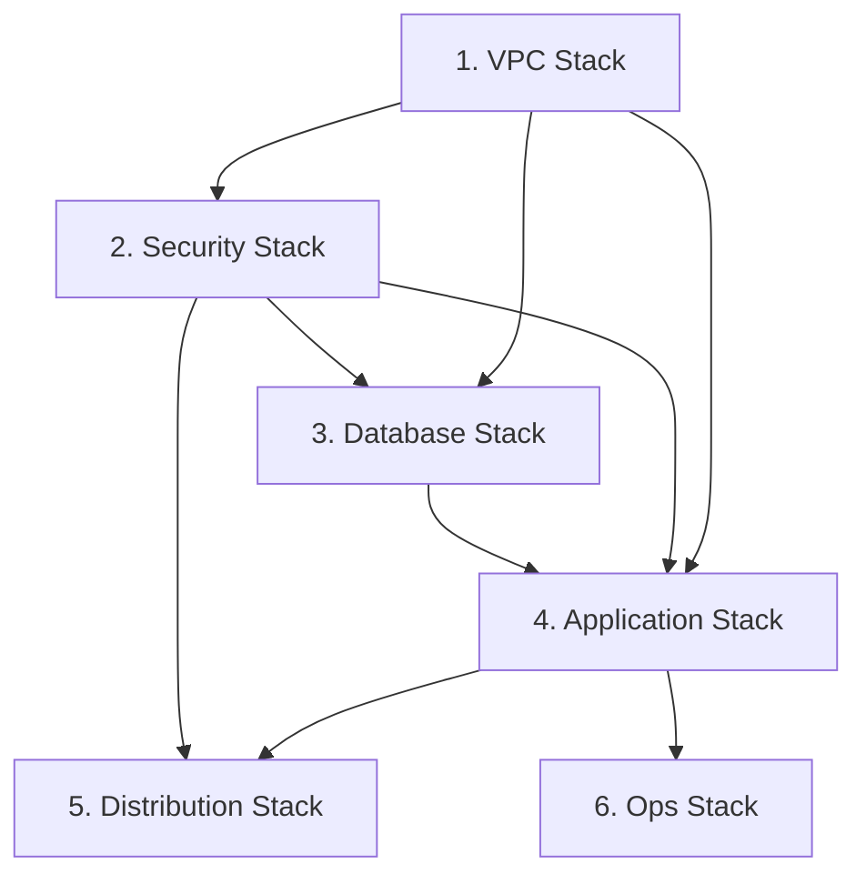

# TASK-0007: Security Stack 統合 - TDD開発ノート

**タスクID**: TASK-0007
**タスクタイプ**: TDD
**推定工数**: 4時間
**フェーズ**: Phase 2 - セキュリティ・データベース

---

## 1. 技術スタック

### 使用技術・フレームワーク

| カテゴリ | 技術 | バージョン |
|---------|------|-----------|
| IaC | AWS CDK | v2.213.0 |
| 言語 | TypeScript | ~5.6.3 |
| テスト | Jest | ^29.7.0 |
| ランタイム | Node.js | ES2018 Target |

### アーキテクチャパターン

- **パターン**: Multi-Tier Serverless Architecture
- **セキュリティ設計**: 最小権限の原則に基づく Security Group + IAM Role の統合管理
- **Stack 分離**: 機能別に 6 つの Stack に分割、Security Stack はセキュリティリソースを一元管理
- **依存関係**: VPC Stack から VPC を受け取り、後続の Stack にセキュリティリソースを提供

### 主要CDKモジュール

```typescript
import * as cdk from 'aws-cdk-lib';
import * as ec2 from 'aws-cdk-lib/aws-ec2';
import * as iam from 'aws-cdk-lib/aws-iam';
import { Construct } from 'constructs';
import { SecurityGroupConstruct } from '../construct/security/security-group-construct';
import { IamRoleConstruct } from '../construct/security/iam-role-construct';
import { EnvironmentConfig } from '../../parameter';
```

**参照元**:
- `infra/package.json`
- `infra/tsconfig.json`
- `docs/design/aws-cdk-serverless-architecture/architecture.md`

---

## 2. 開発ルール

### プロジェクト固有ルール

1. **CDKコマンド実行**: `npx` を使用してワークスペースローカルのCDKバージョンを使用
2. **パラメータ管理**: `parameter.ts` で環境別設定を管理
3. **スタック分割**: 機能別に6つのスタックに分割
4. **テスト方式**: Jest スナップショットテスト + Assertions
5. **セキュリティ**: 最小権限の原則を徹底

### コーディング規約

| 項目 | 規約 |
|------|------|
| ファイル命名 | kebab-case (例: `security-stack.ts`) |
| クラス命名 | PascalCase (例: `SecurityStack`) |
| インターフェース | 型定義ファイルで一元管理 |
| エクスポート | Named Export を使用 |
| コメント | JSDoc形式で機能・信頼性レベルを記載 |

### ディレクトリ構造

```
infra/
├── bin/
│   └── infra.ts              # CDK App エントリーポイント
├── lib/
│   ├── stack/
│   │   ├── vpc-stack.ts      # VPC Stack (完了)
│   │   └── security-stack.ts # 実装対象
│   └── construct/
│       ├── vpc/
│       │   ├── vpc-construct.ts      # VPC Construct (完了)
│       │   └── endpoints-construct.ts # Endpoints Construct (完了)
│       └── security/
│           ├── security-group-construct.ts  # Security Group (完了 - TASK-0005)
│           └── iam-role-construct.ts        # IAM Role (完了 - TASK-0006)
├── test/
│   ├── vpc-stack.test.ts                    # VPC Stack テスト (参考)
│   └── security-stack.test.ts               # テストファイル（実装対象）
└── parameter.ts              # 環境別パラメータ
```

**参照元**:
- `CLAUDE.md`
- `docs/design/aws-cdk-serverless-architecture/architecture.md`
- `infra/lib/stack/vpc-stack.ts`

---

## 3. 関連実装

### 既存コード（依存先）

| ファイル | 内容 | 状態 |
|---------|------|------|
| `infra/lib/stack/vpc-stack.ts` | VPC Stack 実装 | 完了 (TASK-0004) |
| `infra/lib/construct/security/security-group-construct.ts` | Security Group Construct 実装 | 完了 (TASK-0005) |
| `infra/lib/construct/security/iam-role-construct.ts` | IAM Role Construct 実装 | 完了 (TASK-0006) |
| `infra/parameter.ts` | 環境別パラメータ設定 | 完了 |

### VpcStack インターフェース (参照パターン)

```typescript
// infra/lib/stack/vpc-stack.ts より
export interface VpcStackProps extends cdk.StackProps {
  readonly config: EnvironmentConfig;
}

export class VpcStack extends cdk.Stack {
  public readonly vpc: ec2.IVpc;
  public readonly publicSubnets: ec2.ISubnet[];
  public readonly privateAppSubnets: ec2.ISubnet[];
  public readonly privateDbSubnets: ec2.ISubnet[];
}
```

### SecurityGroupConstruct インターフェース

```typescript
// infra/lib/construct/security/security-group-construct.ts より
export interface SecurityGroupConstructProps {
  readonly vpc: ec2.IVpc;
  readonly containerPort?: number;  // default: 80
}

export class SecurityGroupConstruct extends Construct {
  public readonly albSecurityGroup: ec2.ISecurityGroup;
  public readonly ecsSecurityGroup: ec2.ISecurityGroup;
  public readonly auroraSecurityGroup: ec2.ISecurityGroup;
}
```

### IamRoleConstruct インターフェース

```typescript
// infra/lib/construct/security/iam-role-construct.ts より
export interface IamRoleConstructProps {
  readonly secretArns?: string[];  // default: ['*']
}

export class IamRoleConstruct extends Construct {
  public readonly taskRole: iam.IRole;
  public readonly executionRole: iam.IRole;
}
```

### EnvironmentConfig インターフェース

```typescript
// infra/parameter.ts より
export interface EnvironmentConfig {
  envName: string;
  account: string;
  region: string;
  vpcCidr: string;
  taskCpu: number;
  taskMemory: number;
  desiredCount: number;
  auroraMinCapacity: number;
  auroraMaxCapacity: number;
  logRetentionDays: number;
  slackWorkspaceId: string;
  slackChannelId: string;
}
```

**参照元**:
- `infra/lib/stack/vpc-stack.ts`
- `infra/lib/construct/security/security-group-construct.ts`
- `infra/lib/construct/security/iam-role-construct.ts`
- `infra/parameter.ts`

---

## 4. 設計文書

### アーキテクチャ仕様

#### Security Stack の責務

**信頼性**: 🔵 *設計文書・タスク定義書より*

| 責務 | 内容 |
|------|------|
| セキュリティ一元管理 | Security Groups, IAM Roles |
| VPC 依存関係 | VPC Stack から VPC を受け取り |
| リソース公開 | 他 Stack へセキュリティリソースを公開 |

#### Security Stack が公開するプロパティ

**信頼性**: 🔵 *CDK ベストプラクティス・タスク定義書より*

| プロパティ | 型 | 用途 |
|-----------|-----|------|
| ecsSecurityGroup | ec2.ISecurityGroup | ECS タスク用 SG |
| auroraSecurityGroup | ec2.ISecurityGroup | Aurora 用 SG |
| ecsTaskRole | iam.IRole | ECS タスク実行中の権限 |
| ecsTaskExecutionRole | iam.IRole | ECS タスク起動時の権限 |

#### Stack 依存関係図



### 関連要件 (REQ)

| 要件ID | 内容 | 信頼性 |
|--------|------|--------|
| REQ-024 | Aurora Security Group で外部からの直接アクセスを遮断 | 🔵 |
| REQ-025 | Aurora Security Group で ECS からの 3306 ポートアクセスのみ許可 | 🔵 |
| REQ-018 | Task Role に `AmazonSSMManagedInstanceCore` 権限を付与 | 🔵 |
| REQ-028 | ALB を Public Subnet に配置、Internet-facing | 🔵 |
| REQ-029 | ALB で HTTP(80) リクエストを HTTPS(443) にリダイレクト | 🔵 |

### SecurityStack 実装パターン（推奨）

```typescript
import * as cdk from 'aws-cdk-lib';
import * as ec2 from 'aws-cdk-lib/aws-ec2';
import * as iam from 'aws-cdk-lib/aws-iam';
import { Construct } from 'constructs';
import { SecurityGroupConstruct } from '../construct/security/security-group-construct';
import { IamRoleConstruct } from '../construct/security/iam-role-construct';
import { EnvironmentConfig } from '../../parameter';

export interface SecurityStackProps extends cdk.StackProps {
  /** VPC への参照（必須） */
  readonly vpc: ec2.IVpc;
  /** 環境設定（必須） */
  readonly config: EnvironmentConfig;
}

export class SecurityStack extends cdk.Stack {
  /** ECS 用 Security Group */
  public readonly ecsSecurityGroup: ec2.ISecurityGroup;

  /** Aurora 用 Security Group */
  public readonly auroraSecurityGroup: ec2.ISecurityGroup;

  /** ALB 用 Security Group */
  public readonly albSecurityGroup: ec2.ISecurityGroup;

  /** ECS Task Role */
  public readonly ecsTaskRole: iam.IRole;

  /** ECS Task Execution Role */
  public readonly ecsTaskExecutionRole: iam.IRole;

  constructor(scope: Construct, id: string, props: SecurityStackProps) {
    super(scope, id, props);

    // SecurityGroupConstruct の作成
    const securityGroups = new SecurityGroupConstruct(this, 'SecurityGroups', {
      vpc: props.vpc,
    });

    // IamRoleConstruct の作成
    const iamRoles = new IamRoleConstruct(this, 'IamRoles', {});

    // プロパティ公開
    this.ecsSecurityGroup = securityGroups.ecsSecurityGroup;
    this.auroraSecurityGroup = securityGroups.auroraSecurityGroup;
    this.albSecurityGroup = securityGroups.albSecurityGroup;
    this.ecsTaskRole = iamRoles.taskRole;
    this.ecsTaskExecutionRole = iamRoles.executionRole;
  }
}
```

### CDK App エントリーポイント更新パターン

```typescript
// bin/infra.ts
import { App } from 'aws-cdk-lib';
import { VpcStack } from '../lib/stack/vpc-stack';
import { SecurityStack } from '../lib/stack/security-stack';
import { devConfig, prodConfig } from '../parameter';

const app = new App();

const env = app.node.tryGetContext('env') || 'dev';
const config = env === 'prod' ? prodConfig : devConfig;

// VPC Stack
const vpcStack = new VpcStack(app, `VpcStack-${config.envName}`, {
  config,
  env: {
    account: config.account,
    region: config.region,
  },
});

// Security Stack（VPC Stack に依存）
const securityStack = new SecurityStack(app, `SecurityStack-${config.envName}`, {
  vpc: vpcStack.vpc,
  config,
  env: {
    account: config.account,
    region: config.region,
  },
});
securityStack.addDependency(vpcStack);
```

**参照元**:
- `docs/spec/aws-cdk-serverless-architecture/requirements.md`
- `docs/design/aws-cdk-serverless-architecture/architecture.md`
- `docs/tasks/aws-cdk-serverless-architecture/TASK-0007.md`
- `infra/lib/stack/vpc-stack.ts`

---

## 5. テスト要件

### テストケース概要

| テストID | 内容 | 信頼性 |
|---------|------|--------|
| TC-SS-01 | スナップショットテスト | 🔵 |
| TC-SS-02 | Security Group が 3 つ作成されること | 🔵 |
| TC-SS-03 | IAM Role が 2 つ作成されること | 🔵 |
| TC-SS-04 | VPC 依存関係が正しく解決されること | 🔵 |
| TC-SS-05 | ecsSecurityGroup プロパティが公開されること | 🔵 |
| TC-SS-06 | auroraSecurityGroup プロパティが公開されること | 🔵 |
| TC-SS-07 | albSecurityGroup プロパティが公開されること | 🔵 |
| TC-SS-08 | ecsTaskRole プロパティが公開されること | 🔵 |
| TC-SS-09 | ecsTaskExecutionRole プロパティが公開されること | 🔵 |
| TC-SS-10 | Aurora SG で ECS からの 3306 のみ許可されていること | 🔵 |
| TC-SS-11 | Task Role に AmazonSSMManagedInstanceCore が付与されていること | 🔵 |
| TC-SS-12 | Execution Role に AmazonECSTaskExecutionRolePolicy が付与されていること | 🔵 |
| TC-SS-13 | 環境別設定（Dev/Prod）で正常に動作すること | 🔵 |

### テスト実装パターン

```typescript
import * as cdk from 'aws-cdk-lib';
import { Template, Match } from 'aws-cdk-lib/assertions';
import * as ec2 from 'aws-cdk-lib/aws-ec2';
import { SecurityStack } from '../lib/stack/security-stack';
import { devConfig, prodConfig, EnvironmentConfig } from '../parameter';

describe('SecurityStack', () => {
  let app: cdk.App;
  let vpc: ec2.Vpc;
  let vpcStack: cdk.Stack;
  let stack: SecurityStack;
  let template: Template;

  beforeEach(() => {
    app = new cdk.App();
    // テスト用 VPC Stack を作成
    vpcStack = new cdk.Stack(app, 'TestVpcStack');
    vpc = new ec2.Vpc(vpcStack, 'TestVpc');

    // SecurityStack を作成
    stack = new SecurityStack(app, 'TestSecurityStack', {
      vpc,
      config: devConfig,
      env: {
        account: '123456789012',
        region: 'ap-northeast-1',
      },
    });
    template = Template.fromStack(stack);
  });

  // TC-SS-01: スナップショットテスト
  test('CloudFormation テンプレートのスナップショットテスト', () => {
    expect(template.toJSON()).toMatchSnapshot();
  });

  // TC-SS-02: Security Group が 3 つ作成されること
  test('Security Group が 3 つ作成されること', () => {
    template.resourceCountIs('AWS::EC2::SecurityGroup', 3);
  });

  // TC-SS-03: IAM Role が 2 つ作成されること
  test('IAM Role が 2 つ作成されること', () => {
    template.resourceCountIs('AWS::IAM::Role', 2);
  });

  // TC-SS-05〜09: プロパティ公開確認
  test('ecsSecurityGroup プロパティが公開されること', () => {
    expect(stack.ecsSecurityGroup).toBeDefined();
    expect(stack.ecsSecurityGroup.securityGroupId).toBeDefined();
  });

  test('ecsTaskRole プロパティが公開されること', () => {
    expect(stack.ecsTaskRole).toBeDefined();
    expect(stack.ecsTaskRole.roleArn).toBeDefined();
  });

  // TC-SS-10: Aurora SG で ECS からの 3306 のみ許可
  test('Aurora SG で ECS からの 3306 のみ許可されていること', () => {
    template.hasResourceProperties('AWS::EC2::SecurityGroupIngress', {
      IpProtocol: 'tcp',
      FromPort: 3306,
      ToPort: 3306,
    });
  });

  // TC-SS-11: Task Role に AmazonSSMManagedInstanceCore が付与
  test('Task Role に AmazonSSMManagedInstanceCore が付与されていること', () => {
    template.hasResourceProperties('AWS::IAM::Role', {
      ManagedPolicyArns: Match.arrayWith([
        Match.objectLike({
          'Fn::Join': Match.arrayWith([
            Match.arrayWith([
              Match.stringLikeRegexp('.*AmazonSSMManagedInstanceCore.*'),
            ]),
          ]),
        }),
      ]),
    });
  });
});
```

**参照元**:
- `docs/spec/aws-cdk-serverless-architecture/acceptance-criteria.md`
- `docs/tasks/aws-cdk-serverless-architecture/TASK-0007.md`
- `infra/test/vpc-stack.test.ts` (参考パターン)

---

## 6. 実装対象ファイル

### 新規作成ファイル

| ファイル | 説明 |
|---------|------|
| `infra/lib/stack/security-stack.ts` | Security Stack 実装 |
| `infra/test/security-stack.test.ts` | Security Stack テスト |

### 更新対象ファイル

| ファイル | 説明 |
|---------|------|
| `infra/bin/infra.ts` | CDK App エントリーポイント更新（SecurityStack 追加） |

### 実装インターフェース

```typescript
// SecurityStackProps
export interface SecurityStackProps extends cdk.StackProps {
  /** VPC への参照（必須）*/
  readonly vpc: ec2.IVpc;
  /** 環境設定（必須） */
  readonly config: EnvironmentConfig;
}

// SecurityStack
export class SecurityStack extends cdk.Stack {
  /** ECS 用 Security Group */
  public readonly ecsSecurityGroup: ec2.ISecurityGroup;

  /** Aurora 用 Security Group */
  public readonly auroraSecurityGroup: ec2.ISecurityGroup;

  /** ALB 用 Security Group */
  public readonly albSecurityGroup: ec2.ISecurityGroup;

  /** ECS Task Role */
  public readonly ecsTaskRole: iam.IRole;

  /** ECS Task Execution Role */
  public readonly ecsTaskExecutionRole: iam.IRole;
}
```

---

## 7. 注意事項

### 技術的制約

| 項目 | 制約内容 |
|------|----------|
| リージョン | ap-northeast-1 (Tokyo) 固定 |
| VPC 依存 | VPC Stack から vpc を受け取る必須 |
| Security Group 数 | 3 (ALB, ECS, Aurora) |
| IAM Role 数 | 2 (Task Role, Execution Role) |

### セキュリティ考慮事項

1. **最小権限の原則**:
   - Aurora SG は ECS SG からの 3306 のみ許可
   - Aurora SG のアウトバウンドは完全に制限
   - ECS SG は ALB SG からのトラフィックのみ許可
   - Task Role は ECS Exec と Secrets Manager アクセスに必要な権限のみ
   - Execution Role は ECR Pull と CloudWatch Logs 書き込みに必要な権限のみ

2. **Security Group 参照**:
   - CIDR ベースではなく Security Group 参照を使用
   - これにより動的な IP 変更に対応

3. **スタック間依存関係**:
   - Security Stack は VPC Stack に依存
   - `addDependency()` で明示的に依存関係を設定
   - CloudFormation の順序制御を適切に行う

### CDK ベストプラクティス

1. **Stack のプロパティ公開**:
   - 他の Stack から参照するリソースは public readonly として公開
   - ISecurityGroup, IRole 等のインターフェース型を使用

2. **Construct の統合**:
   - SecurityGroupConstruct と IamRoleConstruct を統合
   - 各 Construct のプロパティを Stack レベルで再公開

3. **環境分離**:
   - parameter.ts で環境別設定を管理
   - Stack ID に環境名を含めて一意に識別

**参照元**:
- `docs/spec/aws-cdk-serverless-architecture/requirements.md`
- `docs/design/aws-cdk-serverless-architecture/architecture.md`
- `docs/implements/aws-cdk-serverless-architecture/TASK-0005/note.md`
- `docs/implements/aws-cdk-serverless-architecture/TASK-0006/note.md`

---

## 8. 依存関係

### 前提タスク

| タスクID | 内容 | 状態 |
|---------|------|------|
| TASK-0004 | VPC Stack 統合 | 完了 |
| TASK-0005 | Security Group Construct 実装 | 完了 |
| TASK-0006 | IAM Role Construct 実装 | 完了 |

### 後続タスク

| タスクID | 内容 | 依存理由 |
|---------|------|----------|
| TASK-0008 | Aurora Construct 実装 | auroraSecurityGroup を参照 |
| TASK-0011 | WAF Construct 実装 | Security Stack に WAF を追加可能 |
| TASK-0014 | Task Definition Construct 実装 | ecsTaskRole, ecsTaskExecutionRole を参照 |
| TASK-0015 | ECS Service Construct 実装 | ecsSecurityGroup を参照 |

---

## 9. TDD 実装手順

### Requirements Phase
1. タスク定義書を確認し、要件を整理
2. Security Stack の構成とプロパティを明確化

### Testcases Phase
1. テストケース一覧を作成
2. 各テストケースの入力・期待値を定義

### Red Phase
1. `infra/test/security-stack.test.ts` を作成
2. スナップショットテストを実装
3. リソース存在確認テストを実装
4. プロパティ公開確認テストを実装
5. テスト実行 → 全て失敗することを確認

### Green Phase
1. `infra/lib/stack/security-stack.ts` を作成
2. SecurityStackProps インターフェースを定義
3. SecurityStack クラスを実装
4. SecurityGroupConstruct と IamRoleConstruct を統合
5. テスト実行 → 全て成功することを確認

### Refactor Phase
1. コードの整理・最適化
2. JSDoc コメント追加
3. bin/infra.ts の更新
4. テスト実行 → 全て成功することを確認

---

## 10. コマンドリファレンス

### 開発コマンド

```bash
# プロジェクトディレクトリ
cd infra

# 依存関係インストール
npm install

# ビルド
npm run build

# テスト実行
npm test

# 特定テストファイル実行
npm test -- security-stack.test.ts

# CDK Synth (CloudFormation テンプレート生成)
npx cdk synth

# CDK Diff (差分確認)
npx cdk diff --profile <aws-profile>
```

### テストコマンド

```bash
# 全テスト実行
npm test

# Watch モード
npm test -- --watch

# カバレッジ付き
npm test -- --coverage

# スナップショット更新
npm test -- -u
```

---

## 11. 信頼性レベルサマリー

- **総項目数**: 13項目 (テストケース)
- 🔵 **青信号**: 13項目 (100%)
- 🟡 **黄信号**: 0項目 (0%)
- 🔴 **赤信号**: 0項目 (0%)

**品質評価**: 高品質 - 全ての要件が要件定義書・設計文書により確認済み

---

## 12. 関連文書リンク

| 文書 | パス |
|------|------|
| タスク定義 | `docs/tasks/aws-cdk-serverless-architecture/TASK-0007.md` |
| 前提タスク (VPC Stack) | `docs/tasks/aws-cdk-serverless-architecture/TASK-0004.md` |
| 前提タスク (Security Group) | `docs/tasks/aws-cdk-serverless-architecture/TASK-0005.md` |
| 前提タスク (IAM Role) | `docs/tasks/aws-cdk-serverless-architecture/TASK-0006.md` |
| 要件定義書 | `docs/spec/aws-cdk-serverless-architecture/requirements.md` |
| ユーザストーリー | `docs/spec/aws-cdk-serverless-architecture/user-stories.md` |
| 受け入れ基準 | `docs/spec/aws-cdk-serverless-architecture/acceptance-criteria.md` |
| アーキテクチャ設計 | `docs/design/aws-cdk-serverless-architecture/architecture.md` |
| データフロー設計 | `docs/design/aws-cdk-serverless-architecture/dataflow.md` |
| タスク概要 | `docs/tasks/aws-cdk-serverless-architecture/overview.md` |
| 依存先実装 (VPC Stack) | `infra/lib/stack/vpc-stack.ts` |
| 依存先実装 (Security Group) | `infra/lib/construct/security/security-group-construct.ts` |
| 依存先実装 (IAM Role) | `infra/lib/construct/security/iam-role-construct.ts` |
| 依存先テスト (VPC Stack) | `infra/test/vpc-stack.test.ts` |
| パラメータ設定 | `infra/parameter.ts` |
| プロジェクト設定 | `infra/package.json` |
| TypeScript設定 | `infra/tsconfig.json` |
| CDK設定 | `infra/cdk.json` |
| TASK-0004 ノート | `docs/implements/aws-cdk-serverless-architecture/TASK-0004/note.md` |
| TASK-0005 ノート | `docs/implements/aws-cdk-serverless-architecture/TASK-0005/note.md` |
| TASK-0006 ノート | `docs/implements/aws-cdk-serverless-architecture/TASK-0006/note.md` |
