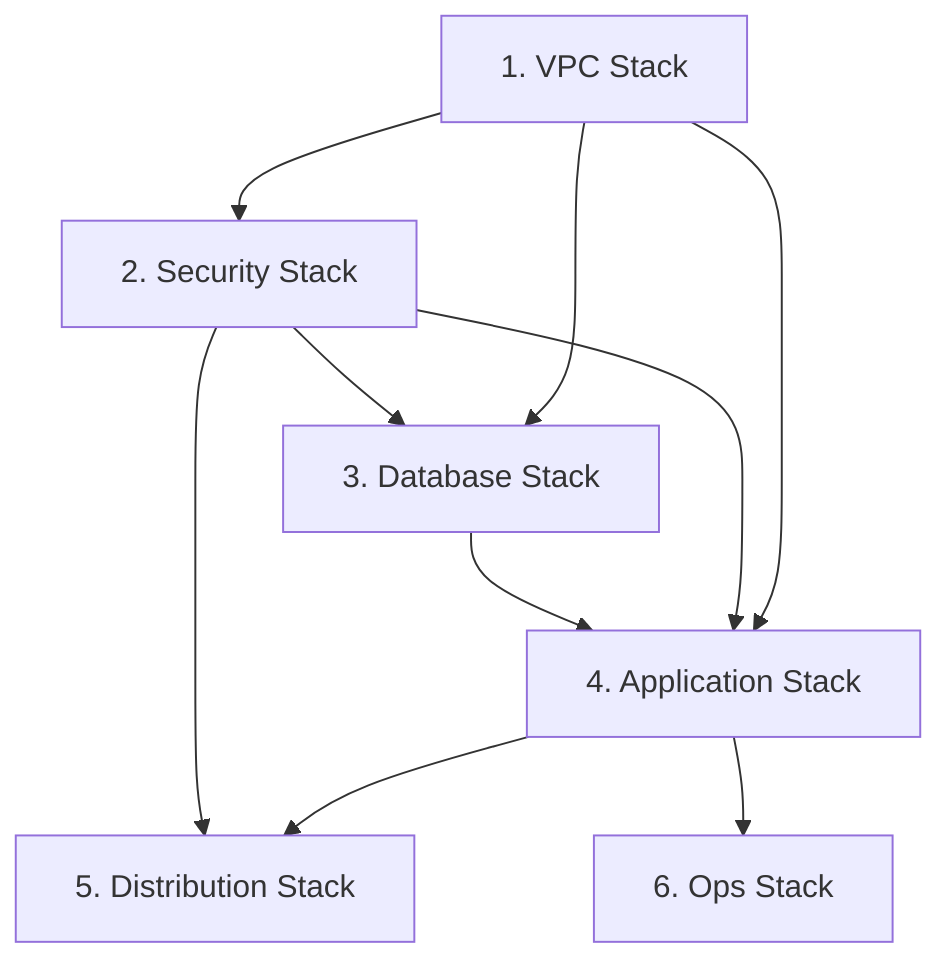
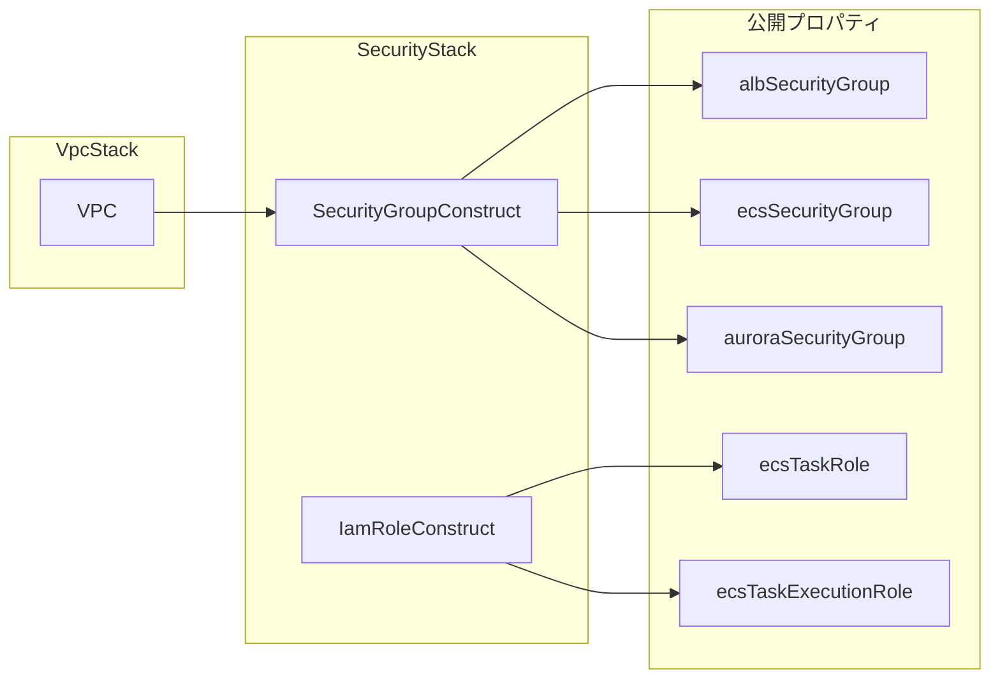

# TASK-0007: Security Stack 統合 - 要件定義書

**タスクID**: TASK-0007
**機能名**: Security Stack Integration
**要件名**: aws-cdk-serverless-architecture
**作成日**: 2026-01-18
**フェーズ**: Phase 2 - セキュリティ・データベース
**信頼性レベル**: 🔵 高品質

---

## 1. 機能の概要

### 1.1 機能説明 🔵

**信頼性**: 🔵 *TASK-0007.md、architecture.md に基づく*

Security Stack は、Phase 1 で個別に実装した Security Group Construct (TASK-0005) と IAM Role Construct (TASK-0006) を統合し、VPC Stack からの依存関係を適切に管理しながら、セキュリティ関連リソースを一元管理する CDK Stack です。

- **何をする機能か**: Security Group と IAM Role を1つの Stack として統合し、他の Stack へセキュリティリソースを公開する
- **どのような問題を解決するか**: セキュリティリソースの一元管理により、リソース間の依存関係を明確化し、スタック間参照を簡素化する
- **想定されるユーザー**: インフラエンジニア、DevOps エンジニア
- **システム内での位置づけ**: VPC Stack の直後に配置され、Database Stack、Application Stack、Distribution Stack、Ops Stack へセキュリティリソースを提供

### 1.2 システムアーキテクチャ上の位置づけ 🔵

**信頼性**: 🔵 *architecture.md、note.md Stack 依存関係図より*



**参照したEARS要件**: REQ-024, REQ-025, REQ-018, REQ-028, REQ-029
**参照した設計文書**:
- `docs/design/aws-cdk-serverless-architecture/architecture.md` - Stack 分割設計セクション
- `docs/tasks/aws-cdk-serverless-architecture/TASK-0007.md` - タスク定義

---

## 2. 入力・出力の仕様

### 2.1 入力パラメータ 🔵

**信頼性**: 🔵 *TASK-0007.md、vpc-stack.ts 実装パターンより*

#### SecurityStackProps インターフェース

| パラメータ | 型 | 必須 | デフォルト | 説明 |
|-----------|-----|------|-----------|------|
| vpc | ec2.IVpc | Yes | - | VPC Stack から渡される VPC 参照 |
| config | EnvironmentConfig | Yes | - | 環境設定（envName, account, region 等） |

```typescript
export interface SecurityStackProps extends cdk.StackProps {
  /** VPC への参照（必須） */
  readonly vpc: ec2.IVpc;
  /** 環境設定（必須） */
  readonly config: EnvironmentConfig;
}
```

### 2.2 出力値（公開プロパティ） 🔵

**信頼性**: 🔵 *TASK-0007.md 完了条件、タスクノートより*

#### SecurityStack クラスの公開プロパティ

| プロパティ | 型 | 説明 | 参照先 Stack |
|-----------|-----|------|-------------|
| albSecurityGroup | ec2.ISecurityGroup | ALB 用 Security Group | Application Stack |
| ecsSecurityGroup | ec2.ISecurityGroup | ECS Fargate タスク用 Security Group | Application Stack, Ops Stack |
| auroraSecurityGroup | ec2.ISecurityGroup | Aurora MySQL 用 Security Group | Database Stack |
| ecsTaskRole | iam.IRole | ECS タスク実行中の権限 | Application Stack |
| ecsTaskExecutionRole | iam.IRole | ECS タスク起動時の権限 | Application Stack |

```typescript
export class SecurityStack extends cdk.Stack {
  public readonly albSecurityGroup: ec2.ISecurityGroup;
  public readonly ecsSecurityGroup: ec2.ISecurityGroup;
  public readonly auroraSecurityGroup: ec2.ISecurityGroup;
  public readonly ecsTaskRole: iam.IRole;
  public readonly ecsTaskExecutionRole: iam.IRole;
}
```

### 2.3 データフロー 🔵

**信頼性**: 🔵 *architecture.md、note.md Stack 依存関係図より*



**参照したEARS要件**: REQ-024, REQ-025, REQ-018
**参照した設計文書**:
- `docs/design/aws-cdk-serverless-architecture/dataflow.md` - セキュリティ境界設計
- `infra/lib/construct/security/security-group-construct.ts` - Security Group 実装

---

## 3. 制約条件

### 3.1 技術的制約 🔵

**信頼性**: 🔵 *parameter.ts、CLAUDE.md より*

| 項目 | 制約内容 | 参照 |
|------|----------|------|
| リージョン | ap-northeast-1 (Tokyo) 固定 | REQ-403 |
| CDK バージョン | v2.213.0 | package.json |
| TypeScript | ~5.6.3 | tsconfig.json |
| Node.js | ES2018 Target | tsconfig.json |
| テストフレームワーク | Jest ^29.7.0 | package.json |

### 3.2 セキュリティ制約 🔵

**信頼性**: 🔵 *requirements.md REQ-024, REQ-025, REQ-018 より*

| 項目 | 制約内容 | 要件ID |
|------|----------|--------|
| Aurora SG インバウンド | ECS SG からの 3306 のみ許可 | REQ-025 |
| Aurora SG アウトバウンド | 完全に制限 (allowAllOutbound: false) | REQ-024 |
| ALB SG インバウンド | 0.0.0.0/0 から HTTP(80)/HTTPS(443) のみ許可 | REQ-028, REQ-029 |
| ECS SG インバウンド | ALB SG からの containerPort のみ許可 | dataflow.md |
| Task Role | AmazonSSMManagedInstanceCore 必須 | REQ-018 |
| Execution Role | AmazonECSTaskExecutionRolePolicy 必須 | TASK-0006.md |

### 3.3 アーキテクチャ制約 🔵

**信頼性**: 🔵 *architecture.md、TASK-0007.md より*

| 項目 | 制約内容 |
|------|----------|
| VPC 依存 | VPC Stack から vpc を受け取る必須 |
| Stack 依存関係 | addDependency() で VPC Stack への依存を明示 |
| Security Group 数 | 3 (ALB, ECS, Aurora) |
| IAM Role 数 | 2 (Task Role, Execution Role) |
| Construct 統合 | SecurityGroupConstruct と IamRoleConstruct を統合 |

**参照したEARS要件**: REQ-024, REQ-025, REQ-018, REQ-028, REQ-029, REQ-403
**参照した設計文書**:
- `docs/spec/aws-cdk-serverless-architecture/requirements.md` - 要件定義
- `docs/design/aws-cdk-serverless-architecture/architecture.md` - Stack 分割設計

---

## 4. 想定される使用例

### 4.1 基本的な使用パターン 🔵

**信頼性**: 🔵 *note.md CDK App エントリーポイント更新パターンより*

#### CDK App エントリーポイントでの使用

```typescript
// bin/infra.ts
import { App } from 'aws-cdk-lib';
import { VpcStack } from '../lib/stack/vpc-stack';
import { SecurityStack } from '../lib/stack/security-stack';
import { devConfig, prodConfig } from '../parameter';

const app = new App();
const env = app.node.tryGetContext('env') || 'dev';
const config = env === 'prod' ? prodConfig : devConfig;

// VPC Stack
const vpcStack = new VpcStack(app, `VpcStack-${config.envName}`, {
  config,
  env: {
    account: config.account,
    region: config.region,
  },
});

// Security Stack（VPC Stack に依存）
const securityStack = new SecurityStack(app, `SecurityStack-${config.envName}`, {
  vpc: vpcStack.vpc,
  config,
  env: {
    account: config.account,
    region: config.region,
  },
});
securityStack.addDependency(vpcStack);
```

### 4.2 後続 Stack での参照パターン 🔵

**信頼性**: 🔵 *note.md Stack 依存関係図より*

```typescript
// Database Stack での Aurora SG 参照
const databaseStack = new DatabaseStack(app, `DatabaseStack-${config.envName}`, {
  vpc: vpcStack.vpc,
  securityGroup: securityStack.auroraSecurityGroup,
  config,
});
databaseStack.addDependency(securityStack);

// Application Stack での ECS リソース参照
const applicationStack = new ApplicationStack(app, `ApplicationStack-${config.envName}`, {
  vpc: vpcStack.vpc,
  ecsSecurityGroup: securityStack.ecsSecurityGroup,
  taskRole: securityStack.ecsTaskRole,
  executionRole: securityStack.ecsTaskExecutionRole,
  config,
});
applicationStack.addDependency(securityStack);
```

### 4.3 エッジケース 🔵

**信頼性**: 🔵 *note.md 注意事項、タスク定義書より*

| ケース | 動作 | 対応 |
|--------|------|------|
| VPC 未指定 | TypeScript コンパイルエラー | vpc は必須パラメータとして定義 |
| config 未指定 | TypeScript コンパイルエラー | config は必須パラメータとして定義 |
| containerPort 未指定 | デフォルト値 80 を使用 | SecurityGroupConstruct のデフォルト値 |
| secretArns 未指定 | デフォルト値 ['*'] を使用 | IamRoleConstruct のデフォルト値 |

### 4.4 エラーケース 🟡

**信頼性**: 🟡 *CDK エラーパターンからの妥当な推測*

| エラー | 原因 | 対応 |
|--------|------|------|
| VPC not found | VPC Stack が未デプロイ | addDependency で依存関係を設定 |
| Circular dependency | 双方向のスタック参照 | 依存関係を単方向に整理 |
| CloudFormation export limit | エクスポート数超過 | CfnOutput の最適化 |

**参照したEARS要件**: なし（エッジケースは推測ベース）
**参照した設計文書**:
- `docs/implements/aws-cdk-serverless-architecture/TASK-0007/note.md` - CDK App エントリーポイント更新パターン

---

## 5. EARS要件・設計文書との対応関係

### 5.1 参照したユーザストーリー 🔵

| ストーリーID | 内容 |
|-------------|------|
| US-002 | インフラエンジニアとして、セキュリティグループを一元管理したい |
| US-003 | 開発者として、DB接続にセキュアな認証を使用したい |

### 5.2 参照した機能要件 🔵

| 要件ID | 内容 | 対応内容 |
|--------|------|----------|
| REQ-018 | Task Role に AmazonSSMManagedInstanceCore 権限を付与 | IamRoleConstruct で実装済み |
| REQ-024 | Aurora SG で外部からの直接アクセスを遮断 | SecurityGroupConstruct で実装済み |
| REQ-025 | Aurora SG で ECS SG からの 3306 のみ許可 | SecurityGroupConstruct で実装済み |
| REQ-028 | ALB を Public Subnet に配置、Internet-facing | SecurityGroupConstruct で HTTP/HTTPS 許可 |
| REQ-029 | HTTP→HTTPS リダイレクト対応 | SecurityGroupConstruct で HTTP(80) 許可 |

### 5.3 参照した非機能要件 🔵

| 要件ID | 内容 | 対応内容 |
|--------|------|----------|
| NFR-101 | VPC Endpoint を使用してトラフィックを AWS 内に閉じる | ECS SG で allowAllOutbound: true |
| NFR-102 | Storage Encryption を有効化 | Database Stack で対応（本タスク外） |

### 5.4 参照したEdgeケース 🔵

| ケースID | 内容 | 対応内容 |
|----------|------|----------|
| EC-01 | secretArns 未指定時のデフォルト値 | IamRoleConstruct で DEFAULT_SECRET_ARNS = ['*'] |

### 5.5 参照した設計文書 🔵

| 文書 | 該当セクション | 参照内容 |
|------|---------------|----------|
| architecture.md | Stack 分割設計 | 6つの Stack 構成、依存関係 |
| dataflow.md | セキュリティ境界設計 | SG 間のトラフィック制御 |
| security-group-construct.ts | 実装全体 | 3つの SG 作成パターン |
| iam-role-construct.ts | 実装全体 | 2つの IAM Role 作成パターン |
| vpc-stack.ts | VpcStackProps | Stack Props 設計パターン |

---

## 6. 実装ファイル

### 6.1 新規作成ファイル 🔵

**信頼性**: 🔵 *note.md 実装対象ファイルより*

| ファイル | 説明 |
|---------|------|
| `infra/lib/stack/security-stack.ts` | Security Stack 実装 |
| `infra/test/security-stack.test.ts` | Security Stack テスト |

### 6.2 更新対象ファイル 🔵

**信頼性**: 🔵 *note.md 実装対象ファイルより*

| ファイル | 説明 |
|---------|------|
| `infra/bin/infra.ts` | CDK App エントリーポイント更新（SecurityStack 追加） |

### 6.3 依存ファイル（参照のみ） 🔵

**信頼性**: 🔵 *note.md 既存コードより*

| ファイル | 状態 |
|---------|------|
| `infra/lib/stack/vpc-stack.ts` | 完了 (TASK-0004) |
| `infra/lib/construct/security/security-group-construct.ts` | 完了 (TASK-0005) |
| `infra/lib/construct/security/iam-role-construct.ts` | 完了 (TASK-0006) |
| `infra/parameter.ts` | 完了 |

---

## 7. テスト要件

### 7.1 テストケース概要 🔵

**信頼性**: 🔵 *note.md テスト要件セクションより*

| テストID | 内容 | カテゴリ |
|---------|------|----------|
| TC-SS-01 | CloudFormation テンプレートのスナップショットテスト | スナップショット |
| TC-SS-02 | Security Group が 3 つ作成されること | リソース存在確認 |
| TC-SS-03 | IAM Role が 2 つ作成されること | リソース存在確認 |
| TC-SS-04 | VPC 依存関係が正しく解決されること | 依存関係確認 |
| TC-SS-05 | ecsSecurityGroup プロパティが公開されること | プロパティ公開確認 |
| TC-SS-06 | auroraSecurityGroup プロパティが公開されること | プロパティ公開確認 |
| TC-SS-07 | albSecurityGroup プロパティが公開されること | プロパティ公開確認 |
| TC-SS-08 | ecsTaskRole プロパティが公開されること | プロパティ公開確認 |
| TC-SS-09 | ecsTaskExecutionRole プロパティが公開されること | プロパティ公開確認 |
| TC-SS-10 | Aurora SG で ECS からの 3306 のみ許可されていること | セキュリティルール確認 |
| TC-SS-11 | Task Role に AmazonSSMManagedInstanceCore が付与されていること | ポリシー確認 |
| TC-SS-12 | Execution Role に AmazonECSTaskExecutionRolePolicy が付与されていること | ポリシー確認 |
| TC-SS-13 | 環境別設定（Dev/Prod）で正常に動作すること | 環境別テスト |

### 7.2 テスト実行コマンド 🔵

```bash
# プロジェクトディレクトリ
cd infra

# 全テスト実行
npm test

# 特定テストファイル実行
npm test -- security-stack.test.ts

# スナップショット更新
npm test -- -u
```

---

## 8. 信頼性レベルサマリー

| セクション | 項目数 | 🔵 青信号 | 🟡 黄信号 | 🔴 赤信号 |
|-----------|--------|----------|----------|----------|
| 1. 機能の概要 | 2 | 2 | 0 | 0 |
| 2. 入力・出力の仕様 | 3 | 3 | 0 | 0 |
| 3. 制約条件 | 3 | 3 | 0 | 0 |
| 4. 想定される使用例 | 4 | 3 | 1 | 0 |
| 5. EARS要件との対応関係 | 5 | 5 | 0 | 0 |
| 6. 実装ファイル | 3 | 3 | 0 | 0 |
| 7. テスト要件 | 2 | 2 | 0 | 0 |
| **合計** | **22** | **21 (95%)** | **1 (5%)** | **0 (0%)** |

---

## 9. 品質評価

**評価結果**: ✅ **高品質**

### 評価基準チェック

| 基準 | 状態 | 備考 |
|------|------|------|
| 要件の曖昧さ | なし | 全ての要件が具体的に定義されている |
| 入出力定義 | 完全 | Props と公開プロパティが明確に定義されている |
| 制約条件 | 明確 | セキュリティ・アーキテクチャ制約が文書化されている |
| 実装可能性 | 確実 | 既存の Construct を統合するため実装は明確 |
| 信頼性レベル | 🔵が多い | 95% が青信号（設計文書に基づく） |

### 改善不要な理由

1. **前提タスク完了済み**: TASK-0004 (VPC Stack), TASK-0005 (Security Group), TASK-0006 (IAM Role) が全て完了
2. **パターン確立済み**: vpc-stack.ts の実装パターンに従う
3. **設計文書完備**: architecture.md, dataflow.md で詳細設計が完了
4. **要件明確**: REQ-024, REQ-025, REQ-018 が具体的に定義済み

---

## 10. 関連文書リンク

| 文書 | パス |
|------|------|
| タスク定義 | `docs/tasks/aws-cdk-serverless-architecture/TASK-0007.md` |
| タスクノート | `docs/implements/aws-cdk-serverless-architecture/TASK-0007/note.md` |
| 要件定義書 | `docs/spec/aws-cdk-serverless-architecture/requirements.md` |
| アーキテクチャ設計 | `docs/design/aws-cdk-serverless-architecture/architecture.md` |
| データフロー設計 | `docs/design/aws-cdk-serverless-architecture/dataflow.md` |
| VPC Stack 実装 | `infra/lib/stack/vpc-stack.ts` |
| Security Group Construct | `infra/lib/construct/security/security-group-construct.ts` |
| IAM Role Construct | `infra/lib/construct/security/iam-role-construct.ts` |
| パラメータ設定 | `infra/parameter.ts` |
