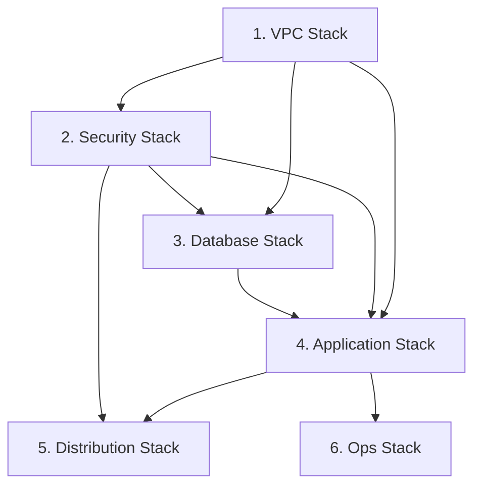

# TASK-0010: Database Stack 統合 - TDD開発ノート

**タスクID**: TASK-0010
**タスクタイプ**: TDD
**推定工数**: 4時間
**フェーズ**: Phase 2 - セキュリティ・データベース

---

## 1. 技術スタック

### 使用技術・フレームワーク

| カテゴリ | 技術 | バージョン |
|---------|------|-----------|
| IaC | AWS CDK | v2.213.0 |
| 言語 | TypeScript | ~5.6.3 |
| テスト | Jest | ^29.7.0 |
| ランタイム | Node.js | ES2018 Target |

### アーキテクチャパターン

- **パターン**: Multi-Tier Serverless Architecture + Sidecar Pattern
- **データベース設計**: Aurora Serverless v2 MySQL + Secrets Manager 統合
- **Stack 分離**: 機能別に 6 つの Stack に分割、Database Stack はデータベース関連リソースを一元管理
- **依存関係**: VPC Stack から VPC/Subnet を、Security Stack から Security Group を受け取り、Application Stack へリソースを提供

### 主要CDKモジュール

```typescript
import * as cdk from 'aws-cdk-lib';
import * as ec2 from 'aws-cdk-lib/aws-ec2';
import * as rds from 'aws-cdk-lib/aws-rds';
import * as secretsmanager from 'aws-cdk-lib/aws-secretsmanager';
import { Construct } from 'constructs';
import { AuroraConstruct } from '../construct/database/aurora-construct';
import { EnvironmentConfig } from '../../parameter';
```

**参照元**:
- `infra/package.json`
- `infra/tsconfig.json`
- `docs/design/aws-cdk-serverless-architecture/architecture.md`

---

## 2. 開発ルール

### プロジェクト固有ルール

1. **CDKコマンド実行**: `npx` を使用してワークスペースローカルのCDKバージョンを使用
2. **パラメータ管理**: `parameter.ts` で環境別設定を管理
3. **スタック分割**: 機能別に6つのスタックに分割
4. **テスト方式**: Jest スナップショットテスト + Assertions
5. **セキュリティ**: 最小権限の原則、Storage Encryption 必須

### コーディング規約

| 項目 | 規約 |
|------|------|
| ファイル命名 | kebab-case (例: `database-stack.ts`) |
| クラス命名 | PascalCase (例: `DatabaseStack`) |
| インターフェース | 型定義ファイルで一元管理 |
| エクスポート | Named Export を使用 |
| コメント | JSDoc形式で機能・信頼性レベルを記載 |

### ディレクトリ構造

```
infra/
├── bin/
│   └── infra.ts              # CDK App エントリーポイント
├── lib/
│   ├── stack/
│   │   ├── vpc-stack.ts      # VPC Stack (完了 - TASK-0004)
│   │   ├── security-stack.ts # Security Stack (完了 - TASK-0007)
│   │   └── database-stack.ts # 実装対象
│   └── construct/
│       ├── vpc/
│       │   ├── vpc-construct.ts      # VPC Construct (完了)
│       │   └── endpoints-construct.ts # Endpoints Construct (完了)
│       ├── security/
│       │   ├── security-group-construct.ts  # Security Group (完了 - TASK-0005)
│       │   └── iam-role-construct.ts        # IAM Role (完了 - TASK-0006)
│       └── database/
│           └── aurora-construct.ts          # Aurora Construct (完了 - TASK-0008, TASK-0009)
├── test/
│   ├── vpc-stack.test.ts                    # VPC Stack テスト (参考)
│   ├── security-stack.test.ts               # Security Stack テスト (参考)
│   └── database-stack.test.ts               # テストファイル（実装対象）
└── parameter.ts              # 環境別パラメータ
```

**参照元**:
- `CLAUDE.md`
- `docs/design/aws-cdk-serverless-architecture/architecture.md`
- `infra/lib/stack/vpc-stack.ts`
- `infra/lib/stack/security-stack.ts`

---

## 3. 関連実装

### 既存コード（依存先）

| ファイル | 内容 | 状態 |
|---------|------|------|
| `infra/lib/stack/vpc-stack.ts` | VPC Stack 実装 | 完了 (TASK-0004) |
| `infra/lib/stack/security-stack.ts` | Security Stack 実装 | 完了 (TASK-0007) |
| `infra/lib/construct/database/aurora-construct.ts` | Aurora Construct 実装 | 完了 (TASK-0008, TASK-0009) |
| `infra/parameter.ts` | 環境別パラメータ設定 | 完了 |

### VpcStack インターフェース (参照パターン)

```typescript
// infra/lib/stack/vpc-stack.ts より
export interface VpcStackProps extends cdk.StackProps {
  readonly config: EnvironmentConfig;
}

export class VpcStack extends cdk.Stack {
  public readonly vpc: ec2.IVpc;
  public readonly publicSubnets: ec2.ISubnet[];
  public readonly privateAppSubnets: ec2.ISubnet[];
  public readonly privateDbSubnets: ec2.ISubnet[];
}
```

### SecurityStack インターフェース

```typescript
// infra/lib/stack/security-stack.ts より
export interface SecurityStackProps extends cdk.StackProps {
  readonly vpc: ec2.IVpc;
  readonly config: EnvironmentConfig;
}

export class SecurityStack extends cdk.Stack {
  public readonly albSecurityGroup: ec2.ISecurityGroup;
  public readonly ecsSecurityGroup: ec2.ISecurityGroup;
  public readonly auroraSecurityGroup: ec2.ISecurityGroup;
  public readonly ecsTaskRole: iam.IRole;
  public readonly ecsTaskExecutionRole: iam.IRole;
}
```

### AuroraConstruct インターフェース

```typescript
// infra/lib/construct/database/aurora-construct.ts より
export interface AuroraConstructProps {
  readonly vpc: ec2.IVpc;
  readonly securityGroup: ec2.ISecurityGroup;
  readonly envName: string;
  readonly minCapacity?: number;  // default: 0.5 ACU
  readonly maxCapacity?: number;  // default: 2 ACU
  readonly databaseName?: string; // default: 'appdb'
  readonly backupRetentionDays?: number; // default: 7
}

export class AuroraConstruct extends Construct {
  public readonly cluster: rds.DatabaseCluster;
  public readonly clusterEndpoint: rds.Endpoint;
  public readonly secret: secretsmanager.ISecret;
  public readonly securityGroup: ec2.ISecurityGroup;

  // ECS タスク用シークレット取得メソッド
  public getSecretsForEcs(): Record<string, ecs.Secret>;
}
```

### EnvironmentConfig インターフェース

```typescript
// infra/parameter.ts より
export interface EnvironmentConfig {
  envName: string;
  account: string;
  region: string;
  vpcCidr: string;
  taskCpu: number;
  taskMemory: number;
  desiredCount: number;
  auroraMinCapacity: number;
  auroraMaxCapacity: number;
  logRetentionDays: number;
  slackWorkspaceId: string;
  slackChannelId: string;
}

// 設定値
export const devConfig: EnvironmentConfig = {
  envName: 'dev',
  auroraMinCapacity: 0.5,
  auroraMaxCapacity: 2,
  // ...
};

export const prodConfig: EnvironmentConfig = {
  envName: 'prod',
  auroraMinCapacity: 0.5,
  auroraMaxCapacity: 2,
  // ...
};
```

**参照元**:
- `infra/lib/stack/vpc-stack.ts`
- `infra/lib/stack/security-stack.ts`
- `infra/lib/construct/database/aurora-construct.ts`
- `infra/parameter.ts`

---

## 4. 設計文書

### アーキテクチャ仕様

#### Database Stack の責務

**信頼性**: 🔵 *設計文書・タスク定義書より*

| 責務 | 内容 |
|------|------|
| データベース一元管理 | Aurora Serverless v2, Secrets Manager |
| VPC/Security 依存関係 | VPC Stack から VPC を、Security Stack から Security Group を受け取り |
| リソース公開 | Application Stack へデータベース接続情報を公開 |

#### Database Stack が公開するプロパティ

**信頼性**: 🔵 *タスク定義書・CDK ベストプラクティスより*

| プロパティ | 型 | 用途 |
|-----------|-----|------|
| auroraCluster | rds.IDatabaseCluster | Aurora クラスターへの参照 |
| dbSecret | secretsmanager.ISecret | DB 認証情報シークレット |
| dbEndpoint | string | Writer エンドポイント hostname |
| dbPort | number | DB 接続ポート (3306) |

#### Stack 依存関係図



### 関連要件 (REQ)

| 要件ID | 内容 | 信頼性 |
|--------|------|--------|
| REQ-022 | Aurora MySQL Serverless v2 を使用 | 🔵 |
| REQ-023 | Private DB Subnet に配置 | 🔵 |
| REQ-024 | 外部からの直接アクセスを遮断 | 🔵 |
| REQ-025 | ECS SG からの 3306 のみ許可 | 🔵 |
| REQ-026 | Storage Encryption 有効化 | 🔵 |
| REQ-027 | 自動バックアップ有効化 | 🔵 |

### DatabaseStack 実装パターン（推奨）

```typescript
import * as cdk from 'aws-cdk-lib';
import * as ec2 from 'aws-cdk-lib/aws-ec2';
import * as rds from 'aws-cdk-lib/aws-rds';
import * as secretsmanager from 'aws-cdk-lib/aws-secretsmanager';
import { Construct } from 'constructs';
import { AuroraConstruct } from '../construct/database/aurora-construct';
import { EnvironmentConfig } from '../../parameter';

export interface DatabaseStackProps extends cdk.StackProps {
  /** VPC への参照（必須） */
  readonly vpc: ec2.IVpc;
  /** Aurora 用 Security Group（必須） */
  readonly auroraSecurityGroup: ec2.ISecurityGroup;
  /** 環境設定（必須） */
  readonly config: EnvironmentConfig;
}

export class DatabaseStack extends cdk.Stack {
  /** Aurora クラスター */
  public readonly auroraCluster: rds.IDatabaseCluster;
  /** DB 認証情報シークレット */
  public readonly dbSecret: secretsmanager.ISecret;
  /** Writer エンドポイント hostname */
  public readonly dbEndpoint: string;
  /** DB 接続ポート */
  public readonly dbPort: number;

  constructor(scope: Construct, id: string, props: DatabaseStackProps) {
    super(scope, id, props);

    // AuroraConstruct の作成
    const aurora = new AuroraConstruct(this, 'Aurora', {
      vpc: props.vpc,
      securityGroup: props.auroraSecurityGroup,
      envName: props.config.envName,
      minCapacity: props.config.auroraMinCapacity,
      maxCapacity: props.config.auroraMaxCapacity,
    });

    // プロパティ公開
    this.auroraCluster = aurora.cluster;
    this.dbSecret = aurora.secret;
    this.dbEndpoint = aurora.clusterEndpoint.hostname;
    this.dbPort = aurora.clusterEndpoint.port;

    // CfnOutput でエクスポート
    new cdk.CfnOutput(this, 'DbEndpoint', {
      value: this.dbEndpoint,
      description: 'Aurora cluster writer endpoint',
      exportName: `${props.config.envName}-DbEndpoint`,
    });
    // ...
  }
}
```

### CDK App エントリーポイント更新パターン

```typescript
// bin/infra.ts
import { App } from 'aws-cdk-lib';
import { VpcStack } from '../lib/stack/vpc-stack';
import { SecurityStack } from '../lib/stack/security-stack';
import { DatabaseStack } from '../lib/stack/database-stack';
import { devConfig, prodConfig } from '../parameter';

const app = new App();

const env = app.node.tryGetContext('env') || 'dev';
const config = env === 'prod' ? prodConfig : devConfig;

// VPC Stack
const vpcStack = new VpcStack(app, `VpcStack-${config.envName}`, {
  config,
  env: { account: config.account, region: config.region },
});

// Security Stack
const securityStack = new SecurityStack(app, `SecurityStack-${config.envName}`, {
  vpc: vpcStack.vpc,
  config,
  env: { account: config.account, region: config.region },
});
securityStack.addDependency(vpcStack);

// Database Stack
const databaseStack = new DatabaseStack(app, `DatabaseStack-${config.envName}`, {
  vpc: vpcStack.vpc,
  auroraSecurityGroup: securityStack.auroraSecurityGroup,
  config,
  env: { account: config.account, region: config.region },
});
databaseStack.addDependency(vpcStack);
databaseStack.addDependency(securityStack);
```

**参照元**:
- `docs/spec/aws-cdk-serverless-architecture/requirements.md`
- `docs/design/aws-cdk-serverless-architecture/architecture.md`
- `docs/tasks/aws-cdk-serverless-architecture/TASK-0010.md`
- `infra/lib/stack/vpc-stack.ts`
- `infra/lib/stack/security-stack.ts`

---

## 5. テスト要件

### テストケース概要

| テストID | 内容 | 信頼性 |
|---------|------|--------|
| TC-DS-01 | スナップショットテスト | 🔵 |
| TC-DS-02 | Aurora クラスターが作成されること | 🔵 |
| TC-DS-03 | Secrets Manager シークレットが作成されること | 🔵 |
| TC-DS-04 | KMS 暗号化キーが作成されること | 🔵 |
| TC-DS-05 | VPC 依存関係が正しく解決されること | 🔵 |
| TC-DS-06 | Security Stack 依存関係が正しく解決されること | 🔵 |
| TC-DS-07 | auroraCluster プロパティが公開されること | 🔵 |
| TC-DS-08 | dbSecret プロパティが公開されること | 🔵 |
| TC-DS-09 | dbEndpoint プロパティが公開されること | 🔵 |
| TC-DS-10 | dbPort プロパティが公開されること | 🔵 |
| TC-DS-11 | Aurora が Private Isolated Subnet に配置されること | 🔵 |
| TC-DS-12 | Storage Encryption が有効化されていること | 🔵 |
| TC-DS-13 | 自動バックアップが有効化されていること | 🔵 |
| TC-DS-14 | CfnOutput でエクスポートが生成されること | 🔵 |
| TC-DS-15 | 環境別設定（Dev/Prod）で正常に動作すること | 🔵 |
| TC-DS-16 | Aurora が Serverless v2 として作成されること | 🔵 |
| TC-DS-17 | minCapacity/maxCapacity が parameter.ts から適用されること | 🔵 |

### テスト実装パターン

```typescript
import * as cdk from 'aws-cdk-lib';
import { Template, Match } from 'aws-cdk-lib/assertions';
import * as ec2 from 'aws-cdk-lib/aws-ec2';
import { DatabaseStack } from '../lib/stack/database-stack';
import { devConfig, prodConfig } from '../parameter';

describe('DatabaseStack', () => {
  let app: cdk.App;
  let vpcStack: cdk.Stack;
  let vpc: ec2.Vpc;
  let securityGroup: ec2.SecurityGroup;
  let stack: DatabaseStack;
  let template: Template;

  const testEnv = {
    account: '123456789012',
    region: 'ap-northeast-1',
  };

  beforeEach(() => {
    app = new cdk.App();
    vpcStack = new cdk.Stack(app, 'TestVpcStack', { env: testEnv });
    vpc = new ec2.Vpc(vpcStack, 'TestVpc');
    securityGroup = new ec2.SecurityGroup(vpcStack, 'TestAuroraSG', { vpc });

    stack = new DatabaseStack(app, 'TestDatabaseStack', {
      vpc,
      auroraSecurityGroup: securityGroup,
      config: devConfig,
      env: testEnv,
    });
    template = Template.fromStack(stack);
  });

  // TC-DS-01: スナップショットテスト
  test('CloudFormation テンプレートのスナップショットテスト', () => {
    expect(template.toJSON()).toMatchSnapshot();
  });

  // TC-DS-02: Aurora クラスターが作成されること
  test('Aurora クラスターが作成されること', () => {
    template.resourceCountIs('AWS::RDS::DBCluster', 1);
  });

  // TC-DS-03: Secrets Manager シークレットが作成されること
  test('Secrets Manager シークレットが作成されること', () => {
    template.hasResourceProperties('AWS::SecretsManager::Secret', {
      GenerateSecretString: Match.objectLike({
        SecretStringTemplate: Match.anyValue(),
        GenerateStringKey: 'password',
      }),
    });
  });

  // TC-DS-07: auroraCluster プロパティが公開されること
  test('auroraCluster プロパティが公開されること', () => {
    expect(stack.auroraCluster).toBeDefined();
  });

  // TC-DS-12: Storage Encryption が有効化されていること
  test('Storage Encryption が有効化されていること', () => {
    template.hasResourceProperties('AWS::RDS::DBCluster', {
      StorageEncrypted: true,
    });
  });

  // TC-DS-16: Aurora が Serverless v2 として作成されること
  test('Aurora が Serverless v2 として作成されること', () => {
    template.hasResourceProperties('AWS::RDS::DBCluster', {
      ServerlessV2ScalingConfiguration: Match.objectLike({
        MinCapacity: 0.5,
        MaxCapacity: 2,
      }),
    });
  });
});
```

**参照元**:
- `docs/spec/aws-cdk-serverless-architecture/acceptance-criteria.md`
- `docs/tasks/aws-cdk-serverless-architecture/TASK-0010.md`
- `infra/test/security-stack.test.ts` (参考パターン)
- `infra/test/construct/database/aurora-construct.test.ts` (参考パターン)

---

## 6. 実装対象ファイル

### 新規作成ファイル

| ファイル | 説明 |
|---------|------|
| `infra/lib/stack/database-stack.ts` | Database Stack 実装 |
| `infra/test/database-stack.test.ts` | Database Stack テスト |

### 更新対象ファイル

| ファイル | 説明 |
|---------|------|
| `infra/bin/infra.ts` | CDK App エントリーポイント更新（DatabaseStack 追加） |

### 実装インターフェース

```typescript
// DatabaseStackProps
export interface DatabaseStackProps extends cdk.StackProps {
  /** VPC への参照（必須）*/
  readonly vpc: ec2.IVpc;
  /** Aurora 用 Security Group（必須） */
  readonly auroraSecurityGroup: ec2.ISecurityGroup;
  /** 環境設定（必須） */
  readonly config: EnvironmentConfig;
}

// DatabaseStack
export class DatabaseStack extends cdk.Stack {
  /** Aurora クラスター */
  public readonly auroraCluster: rds.IDatabaseCluster;
  /** DB 認証情報シークレット */
  public readonly dbSecret: secretsmanager.ISecret;
  /** Writer エンドポイント hostname */
  public readonly dbEndpoint: string;
  /** DB 接続ポート */
  public readonly dbPort: number;
}
```

---

## 7. 注意事項

### 技術的制約

| 項目 | 制約内容 |
|------|----------|
| リージョン | ap-northeast-1 (Tokyo) 固定 |
| VPC 依存 | VPC Stack から vpc を受け取る必須 |
| Security Group 依存 | Security Stack から auroraSecurityGroup を受け取る必須 |
| ACU 範囲 | 0.5 - 128 (Aurora Serverless v2 仕様) |
| バックアップ保持 | 1 - 35 日 (AWS RDS 仕様) |

### Aurora Serverless v2 制約

| 項目 | 制約内容 |
|------|----------|
| 最小 ACU | 0.5 |
| 最大 ACU | 128 |
| エンジン | Aurora MySQL 3.x (MySQL 8.0 互換) |
| サブネット | Private Isolated Subnet に配置 |

### セキュリティ考慮事項

1. **Storage Encryption**:
   - KMS カスタマーマネージドキーを使用
   - キーローテーション有効化
   - 削除保護（removalPolicy: RETAIN）

2. **ネットワーク分離**:
   - Private Isolated Subnet に配置
   - Security Group で ECS からの 3306 のみ許可
   - パブリックアクセス不可

3. **認証情報管理**:
   - Secrets Manager で自動生成・管理
   - ECS タスクへのシークレット注入
   - secretsmanager:GetSecretValue 権限が必要

4. **スタック間依存関係**:
   - Database Stack は VPC Stack と Security Stack に依存
   - `addDependency()` で明示的に依存関係を設定
   - CloudFormation の順序制御を適切に行う

### CDK ベストプラクティス

1. **Stack のプロパティ公開**:
   - 他の Stack から参照するリソースは public readonly として公開
   - IDatabaseCluster, ISecret 等のインターフェース型を使用

2. **Construct の統合**:
   - AuroraConstruct を Stack レベルで統合
   - Construct のプロパティを Stack レベルで再公開

3. **環境分離**:
   - parameter.ts で環境別設定を管理
   - Stack ID に環境名を含めて一意に識別

4. **CfnOutput**:
   - クロススタック参照用にエンドポイント、シークレット ARN をエクスポート
   - 環境名をプレフィックスに含めて一意に識別

**参照元**:
- `docs/spec/aws-cdk-serverless-architecture/requirements.md`
- `docs/design/aws-cdk-serverless-architecture/architecture.md`
- `docs/implements/aws-cdk-serverless-architecture/TASK-0008/note.md`
- `docs/implements/aws-cdk-serverless-architecture/TASK-0007/note.md`

---

## 8. 依存関係

### 前提タスク

| タスクID | 内容 | 状態 |
|---------|------|------|
| TASK-0004 | VPC Stack 統合 | 完了 |
| TASK-0007 | Security Stack 統合 | 完了 |
| TASK-0008 | Aurora Construct 実装 | 完了 |
| TASK-0009 | Secrets Manager 統合 | 完了 |

### 後続タスク

| タスクID | 内容 | 依存理由 |
|---------|------|----------|
| TASK-0014 | Task Definition Construct 実装 | dbSecret, dbEndpoint を参照 |
| TASK-0015 | ECS Service Construct 実装 | Aurora への接続設定 |
| Phase 3 | Application Stack | Database Stack からリソース参照 |

---

## 9. TDD 実装手順

### Requirements Phase
1. タスク定義書を確認し、要件を整理
2. Database Stack の構成とプロパティを明確化

### Testcases Phase
1. テストケース一覧を作成
2. 各テストケースの入力・期待値を定義

### Red Phase
1. `infra/test/database-stack.test.ts` を作成
2. スナップショットテストを実装
3. リソース存在確認テストを実装
4. プロパティ公開確認テストを実装
5. テスト実行 → 全て失敗することを確認

### Green Phase
1. `infra/lib/stack/database-stack.ts` を作成
2. DatabaseStackProps インターフェースを定義
3. DatabaseStack クラスを実装
4. AuroraConstruct を統合
5. テスト実行 → 全て成功することを確認

### Refactor Phase
1. コードの整理・最適化
2. JSDoc コメント追加
3. bin/infra.ts の更新
4. テスト実行 → 全て成功することを確認

---

## 10. コマンドリファレンス

### 開発コマンド

```bash
# プロジェクトディレクトリ
cd infra

# 依存関係インストール
npm install

# ビルド
npm run build

# テスト実行
npm test

# 特定テストファイル実行
npm test -- database-stack.test.ts

# CDK Synth (CloudFormation テンプレート生成)
npx cdk synth

# CDK Diff (差分確認)
npx cdk diff --profile <aws-profile>
```

### テストコマンド

```bash
# 全テスト実行
npm test

# Watch モード
npm test -- --watch

# カバレッジ付き
npm test -- --coverage

# スナップショット更新
npm test -- -u
```

---

## 11. 信頼性レベルサマリー

- **総項目数**: 17項目 (テストケース)
- 🔵 **青信号**: 17項目 (100%)
- 🟡 **黄信号**: 0項目 (0%)
- 🔴 **赤信号**: 0項目 (0%)

**品質評価**: 高品質 - 全ての要件が要件定義書・設計文書・完了済みタスクにより確認済み

---

## 12. 関連文書リンク

| 文書 | パス |
|------|------|
| タスク定義 | `docs/tasks/aws-cdk-serverless-architecture/TASK-0010.md` |
| 前提タスク (VPC Stack) | `docs/tasks/aws-cdk-serverless-architecture/TASK-0004.md` |
| 前提タスク (Security Stack) | `docs/tasks/aws-cdk-serverless-architecture/TASK-0007.md` |
| 前提タスク (Aurora Construct) | `docs/tasks/aws-cdk-serverless-architecture/TASK-0008.md` |
| 前提タスク (Secrets Manager) | `docs/tasks/aws-cdk-serverless-architecture/TASK-0009.md` |
| 要件定義書 | `docs/spec/aws-cdk-serverless-architecture/requirements.md` |
| ユーザストーリー | `docs/spec/aws-cdk-serverless-architecture/user-stories.md` |
| 受け入れ基準 | `docs/spec/aws-cdk-serverless-architecture/acceptance-criteria.md` |
| アーキテクチャ設計 | `docs/design/aws-cdk-serverless-architecture/architecture.md` |
| データフロー設計 | `docs/design/aws-cdk-serverless-architecture/dataflow.md` |
| タスク概要 | `docs/tasks/aws-cdk-serverless-architecture/overview.md` |
| 依存先実装 (VPC Stack) | `infra/lib/stack/vpc-stack.ts` |
| 依存先実装 (Security Stack) | `infra/lib/stack/security-stack.ts` |
| 依存先実装 (Aurora Construct) | `infra/lib/construct/database/aurora-construct.ts` |
| 依存先テスト (VPC Stack) | `infra/test/vpc-stack.test.ts` |
| 依存先テスト (Security Stack) | `infra/test/security-stack.test.ts` |
| 依存先テスト (Aurora Construct) | `infra/test/construct/database/aurora-construct.test.ts` |
| パラメータ設定 | `infra/parameter.ts` |
| プロジェクト設定 | `infra/package.json` |
| TypeScript設定 | `infra/tsconfig.json` |
| CDK設定 | `infra/cdk.json` |
| TASK-0004 ノート | `docs/implements/aws-cdk-serverless-architecture/TASK-0004/note.md` |
| TASK-0007 ノート | `docs/implements/aws-cdk-serverless-architecture/TASK-0007/note.md` |
| TASK-0008 ノート | `docs/implements/aws-cdk-serverless-architecture/TASK-0008/note.md` |
| TASK-0009 ノート | `docs/implements/aws-cdk-serverless-architecture/TASK-0009/note.md` |
