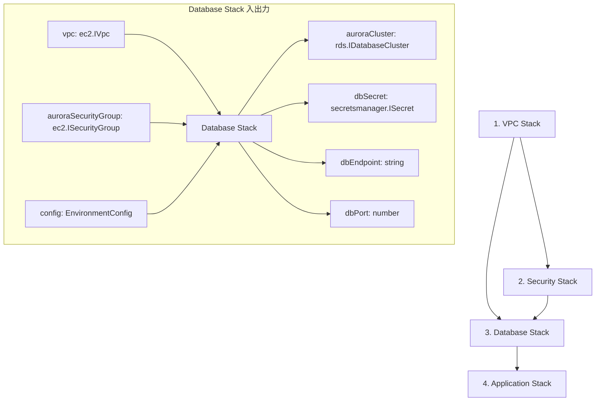

# TASK-0010: Database Stack 統合 - TDD要件定義書

**タスクID**: TASK-0010
**タスクタイプ**: TDD
**推定工数**: 4時間
**フェーズ**: Phase 2 - セキュリティ・データベース
**作成日**: 2026-01-21

**【信頼性レベル凡例】**:
- **青信号**: EARS要件定義書・設計文書・タスク定義書・ユーザヒアリングを参考にした確実な要件
- **黄信号**: EARS要件定義書・設計文書・タスク定義書・ユーザヒアリングから妥当な推測による要件
- **赤信号**: EARS要件定義書・設計文書・タスク定義書・ユーザヒアリングにない推測による要件

---

## 1. タスク概要と目的

### 1.1 概要 🔵

**信頼性**: 🔵 *TASK-0010.md、architecture.md より*

Database Stack は、Aurora Construct と Secrets Manager 統合を組み合わせた CDK Stack であり、データベース関連リソースの一元管理を担います。VPC Stack、Security Stack からの依存関係を適切に解決し、Application Stack へデータベース接続情報を提供します。

### 1.2 目的 🔵

**信頼性**: 🔵 *architecture.md Stack 構成より*

| 目的 | 詳細 |
|------|------|
| データベース一元管理 | Aurora Serverless v2 と Secrets Manager を統合管理 |
| Stack 間依存関係解決 | VPC Stack、Security Stack からのリソース参照を適切に処理 |
| リソースエクスポート | Application Stack へデータベース接続情報を公開 |
| セキュリティ確保 | 最小権限の原則に基づくアクセス制御 |

### 1.3 責務範囲 🔵

**信頼性**: 🔵 *architecture.md 各 Stack の責務より*

Database Stack の責務:

| 責務 | 内容 | 信頼性 |
|------|------|--------|
| Aurora 統合 | AuroraConstruct を使用して Serverless v2 クラスターを作成 | 🔵 |
| Secrets Manager 統合 | Aurora の認証情報を Secrets Manager で管理 | 🔵 |
| 依存関係管理 | VPC Stack から VPC を、Security Stack から Security Group を受け取り | 🔵 |
| リソース公開 | Application Stack へ auroraCluster, dbSecret, dbEndpoint, dbPort を提供 | 🔵 |

---

## 2. 機能要件

### 2.1 関連要件 (REQ-022 〜 REQ-027) 🔵

**信頼性**: 🔵 *requirements.md REQ-022〜027 より*

| 要件ID | 要件内容 | 実装方針 | 信頼性 |
|--------|----------|----------|--------|
| REQ-022 | Aurora MySQL Serverless v2 を使用 | AuroraConstruct を使用して Serverless v2 クラスターを作成 | 🔵 |
| REQ-023 | Private DB Subnet に配置 | VPC の Private Isolated Subnet に配置 | 🔵 |
| REQ-024 | 外部からの直接アクセス遮断 | Security Group でインターネットからのアクセスを禁止 | 🔵 |
| REQ-025 | ECS SG からの 3306 のみ許可 | Security Stack の auroraSecurityGroup を使用 | 🔵 |
| REQ-026 | Storage Encryption 有効化 | AuroraConstruct で KMS 暗号化を設定 | 🔵 |
| REQ-027 | 自動バックアップ有効化 | AuroraConstruct でバックアップ保持期間を設定 | 🔵 |

### 2.2 Stack 統合要件 🔵

**信頼性**: 🔵 *TASK-0010.md、architecture.md Stack 依存関係より*

| ID | 要件 | 詳細 | 信頼性 |
|----|------|------|--------|
| DS-001 | VPC 依存解決 | VPC Stack から vpc を Props として受け取る | 🔵 |
| DS-002 | Security 依存解決 | Security Stack から auroraSecurityGroup を Props として受け取る | 🔵 |
| DS-003 | 環境設定適用 | EnvironmentConfig から auroraMinCapacity、auroraMaxCapacity を取得 | 🔵 |
| DS-004 | Aurora Construct 統合 | AuroraConstruct を内部で使用し、Aurora クラスターを作成 | 🔵 |
| DS-005 | プロパティ公開 | cluster、secret、endpoint、port を public readonly として公開 | 🔵 |
| DS-006 | CfnOutput 生成 | クロススタック参照用に接続情報をエクスポート | 🔵 |

### 2.3 Secrets Manager 統合要件 🔵

**信頼性**: 🔵 *TASK-0009.md、dataflow.md より*

| ID | 要件 | 詳細 | 信頼性 |
|----|------|------|--------|
| SM-001 | 認証情報自動生成 | Aurora の credentials を Secrets Manager で自動生成 | 🔵 |
| SM-002 | シークレット公開 | dbSecret プロパティで Secrets Manager シークレットを公開 | 🔵 |
| SM-003 | ECS 統合対応 | AuroraConstruct の getSecretsForEcs() メソッドを活用可能にする | 🔵 |

---

## 3. 非機能要件

### 3.1 セキュリティ要件 🔵

**信頼性**: 🔵 *NFR-101〜105、requirements.md より*

| ID | 要件 | 詳細 | 信頼性 |
|----|------|------|--------|
| SEC-001 | ネットワーク分離 | Private Isolated Subnet に配置し、インターネットからの直接アクセスを禁止 | 🔵 |
| SEC-002 | ストレージ暗号化 | KMS カスタマーマネージドキーで Storage Encryption を有効化 | 🔵 |
| SEC-003 | 認証情報保護 | Secrets Manager で認証情報を管理し、平文保存を回避 | 🔵 |
| SEC-004 | アクセス制御 | Security Group で ECS からの 3306 のみ許可 | 🔵 |
| SEC-005 | 削除保護 | removalPolicy: SNAPSHOT でスタック削除時にスナップショット作成 | 🔵 |

### 3.2 パフォーマンス要件 🔵

**信頼性**: 🔵 *NFR-001〜004、architecture.md より*

| ID | 要件 | 詳細 | 信頼性 |
|----|------|------|--------|
| PERF-001 | Multi-AZ 配置 | Aurora クラスターを複数 AZ に分散配置 | 🔵 |
| PERF-002 | 自動スケーリング | Serverless v2 の ACU 設定で自動スケーリングを有効化 | 🔵 |
| PERF-003 | ACU 最小値 | Dev: 0.5 ACU、Prod: 0.5 ACU（コスト優先） | 🔵 |
| PERF-004 | ACU 最大値 | Dev: 2 ACU、Prod: 2 ACU（コスト優先） | 🔵 |

### 3.3 運用性要件 🔵

**信頼性**: 🔵 *NFR-301〜303、requirements.md より*

| ID | 要件 | 詳細 | 信頼性 |
|----|------|------|--------|
| OPS-001 | 自動バックアップ | REQ-027 に従い自動バックアップを有効化（デフォルト 7 日間） | 🔵 |
| OPS-002 | エクスポート | CfnOutput でエンドポイント、シークレット ARN をエクスポート | 🔵 |
| OPS-003 | 環境識別 | envName をリソース名に含め、環境を識別可能にする | 🔵 |

---

## 4. 入力仕様（DatabaseStackProps インターフェース）

### 4.1 Props 定義 🔵

**信頼性**: 🔵 *note.md 実装パターン、TASK-0010.md より*

```typescript
export interface DatabaseStackProps extends cdk.StackProps {
  /** VPC への参照（必須）*/
  readonly vpc: ec2.IVpc;

  /** Aurora 用 Security Group（必須）*/
  readonly auroraSecurityGroup: ec2.ISecurityGroup;

  /** 環境設定（必須）*/
  readonly config: EnvironmentConfig;
}
```

### 4.2 Props 詳細 🔵

**信頼性**: 🔵 *note.md、architecture.md より*

| プロパティ | 型 | 必須 | 説明 | 提供元 | 信頼性 |
|-----------|-----|------|------|--------|--------|
| vpc | ec2.IVpc | 必須 | Aurora を配置する VPC | VPC Stack | 🔵 |
| auroraSecurityGroup | ec2.ISecurityGroup | 必須 | Aurora 用 Security Group（ECS からの 3306 許可済み） | Security Stack | 🔵 |
| config | EnvironmentConfig | 必須 | 環境設定（envName、auroraMinCapacity、auroraMaxCapacity 等） | parameter.ts | 🔵 |

### 4.3 EnvironmentConfig から使用する設定 🔵

**信頼性**: 🔵 *parameter.ts より*

| 設定項目 | 型 | Dev 値 | Prod 値 | 用途 | 信頼性 |
|----------|-----|--------|---------|------|--------|
| envName | string | 'dev' | 'prod' | リソース命名、CfnOutput exportName | 🔵 |
| auroraMinCapacity | number | 0.5 | 0.5 | Aurora Serverless v2 最小 ACU | 🔵 |
| auroraMaxCapacity | number | 2 | 2 | Aurora Serverless v2 最大 ACU | 🔵 |

---

## 5. 出力仕様（公開プロパティ）

### 5.1 公開プロパティ定義 🔵

**信頼性**: 🔵 *note.md、TASK-0010.md より*

```typescript
export class DatabaseStack extends cdk.Stack {
  /** Aurora クラスター */
  public readonly auroraCluster: rds.IDatabaseCluster;

  /** DB 認証情報シークレット */
  public readonly dbSecret: secretsmanager.ISecret;

  /** Writer エンドポイント hostname */
  public readonly dbEndpoint: string;

  /** DB 接続ポート */
  public readonly dbPort: number;
}
```

### 5.2 プロパティ詳細 🔵

**信頼性**: 🔵 *note.md、architecture.md より*

| プロパティ | 型 | 説明 | 参照元（AuroraConstruct） | 用途 | 信頼性 |
|-----------|-----|------|---------------------------|------|--------|
| auroraCluster | rds.IDatabaseCluster | Aurora クラスターへの参照 | aurora.cluster | 監視設定、参照 | 🔵 |
| dbSecret | secretsmanager.ISecret | DB 認証情報シークレット | aurora.secret | ECS タスク定義のシークレット注入 | 🔵 |
| dbEndpoint | string | Writer エンドポイント hostname | aurora.clusterEndpoint.hostname | 接続設定 | 🔵 |
| dbPort | number | DB 接続ポート (3306) | aurora.clusterEndpoint.port | 接続設定 | 🔵 |

### 5.3 プロパティ取得元マッピング 🔵

**信頼性**: 🔵 *aurora-construct.ts 実装より*

```typescript
// Database Stack 内部での設定
const aurora = new AuroraConstruct(this, 'Aurora', {
  vpc: props.vpc,
  securityGroup: props.auroraSecurityGroup,
  envName: props.config.envName,
  minCapacity: props.config.auroraMinCapacity,
  maxCapacity: props.config.auroraMaxCapacity,
});

// プロパティ公開
this.auroraCluster = aurora.cluster;          // rds.DatabaseCluster
this.dbSecret = aurora.secret;                 // secretsmanager.ISecret
this.dbEndpoint = aurora.clusterEndpoint.hostname;  // string
this.dbPort = aurora.clusterEndpoint.port;     // number (3306)
```

---

## 6. CfnOutput エクスポート仕様

### 6.1 エクスポート一覧 🔵

**信頼性**: 🔵 *note.md、CDK ベストプラクティスより*

| Output ID | 値 | exportName | 説明 | 用途 | 信頼性 |
|-----------|-----|------------|------|------|--------|
| DbEndpoint | this.dbEndpoint | `${envName}-DbEndpoint` | Aurora Writer エンドポイント | Application Stack 参照用 | 🔵 |
| DbPort | this.dbPort.toString() | `${envName}-DbPort` | DB 接続ポート | Application Stack 参照用 | 🔵 |
| DbSecretArn | this.dbSecret.secretArn | `${envName}-DbSecretArn` | シークレット ARN | Application Stack 参照用 | 🔵 |
| AuroraClusterArn | this.auroraCluster.clusterArn | `${envName}-AuroraClusterArn` | クラスター ARN | 監視・運用参照用 | 🔵 |

### 6.2 CfnOutput 実装パターン 🔵

**信頼性**: 🔵 *security-stack.ts 参考より*

```typescript
// エンドポイントエクスポート
new cdk.CfnOutput(this, 'DbEndpoint', {
  value: this.dbEndpoint,
  description: 'Aurora cluster writer endpoint',
  exportName: `${props.config.envName}-DbEndpoint`,
});

// ポートエクスポート
new cdk.CfnOutput(this, 'DbPort', {
  value: this.dbPort.toString(),
  description: 'Aurora cluster port',
  exportName: `${props.config.envName}-DbPort`,
});

// シークレット ARN エクスポート
new cdk.CfnOutput(this, 'DbSecretArn', {
  value: this.dbSecret.secretArn,
  description: 'Aurora database secret ARN',
  exportName: `${props.config.envName}-DbSecretArn`,
});

// クラスター ARN エクスポート
new cdk.CfnOutput(this, 'AuroraClusterArn', {
  value: this.auroraCluster.clusterArn,
  description: 'Aurora cluster ARN',
  exportName: `${props.config.envName}-AuroraClusterArn`,
});
```

---

## 7. 受け入れ基準（完了条件の詳細化）

### 7.1 基本完了条件 🔵

**信頼性**: 🔵 *TASK-0010.md 完了条件より*

| ID | 条件 | 検証方法 | 信頼性 |
|----|------|----------|--------|
| AC-001 | Database Stack が VPC Stack、Security Stack からの依存関係を正しく解決している | 依存関係テスト | 🔵 |
| AC-002 | Aurora Construct と Secrets Manager Construct が統合されている | リソース存在テスト | 🔵 |
| AC-003 | データベース接続情報が適切にエクスポートされている | CfnOutput 確認テスト | 🔵 |
| AC-004 | すべてのユニットテストが通過している | Jest テスト実行 | 🔵 |
| AC-005 | cdk synth でエラーなく CloudFormation テンプレートが生成される | Synth 実行確認 | 🔵 |

### 7.2 テストケース別完了条件 🔵

**信頼性**: 🔵 *note.md テスト要件より*

#### 7.2.1 スナップショット・リソース存在テスト

| テストID | 内容 | 期待結果 | 信頼性 |
|----------|------|----------|--------|
| TC-DS-01 | スナップショットテスト | CloudFormation テンプレートがスナップショットと一致 | 🔵 |
| TC-DS-02 | Aurora クラスター作成確認 | AWS::RDS::DBCluster が 1 つ存在 | 🔵 |
| TC-DS-03 | Secrets Manager シークレット作成確認 | AWS::SecretsManager::Secret が存在 | 🔵 |
| TC-DS-04 | KMS 暗号化キー作成確認 | AWS::KMS::Key が存在 | 🔵 |

#### 7.2.2 依存関係テスト

| テストID | 内容 | 期待結果 | 信頼性 |
|----------|------|----------|--------|
| TC-DS-05 | VPC 依存関係解決 | Props で受け取った VPC が Aurora に設定 | 🔵 |
| TC-DS-06 | Security Stack 依存関係解決 | Props で受け取った Security Group が Aurora に設定 | 🔵 |

#### 7.2.3 プロパティ公開テスト

| テストID | 内容 | 期待結果 | 信頼性 |
|----------|------|----------|--------|
| TC-DS-07 | auroraCluster プロパティ公開 | stack.auroraCluster が定義されている | 🔵 |
| TC-DS-08 | dbSecret プロパティ公開 | stack.dbSecret が定義されている | 🔵 |
| TC-DS-09 | dbEndpoint プロパティ公開 | stack.dbEndpoint が string 型で定義 | 🔵 |
| TC-DS-10 | dbPort プロパティ公開 | stack.dbPort が number 型で定義 | 🔵 |

#### 7.2.4 セキュリティ・設定テスト

| テストID | 内容 | 期待結果 | 信頼性 |
|----------|------|----------|--------|
| TC-DS-11 | Private Isolated Subnet 配置 | Aurora が PRIVATE_ISOLATED サブネットに配置 | 🔵 |
| TC-DS-12 | Storage Encryption 有効化 | StorageEncrypted: true が設定 | 🔵 |
| TC-DS-13 | 自動バックアップ有効化 | backup.retention が設定 | 🔵 |
| TC-DS-14 | CfnOutput エクスポート生成 | 4 つの CfnOutput が存在 | 🔵 |

#### 7.2.5 環境別・Serverless v2 テスト

| テストID | 内容 | 期待結果 | 信頼性 |
|----------|------|----------|--------|
| TC-DS-15 | 環境別設定（Dev/Prod） | 各環境で正常に Stack が合成される | 🔵 |
| TC-DS-16 | Serverless v2 確認 | ServerlessV2ScalingConfiguration が設定 | 🔵 |
| TC-DS-17 | minCapacity/maxCapacity 適用 | parameter.ts の値が Aurora に反映 | 🔵 |

---

## 8. 制約事項

### 8.1 技術的制約 🔵

**信頼性**: 🔵 *note.md 注意事項より*

| 項目 | 制約内容 | 影響 | 信頼性 |
|------|----------|------|--------|
| リージョン | ap-northeast-1 (Tokyo) 固定 | Stack デプロイ先リージョン | 🔵 |
| VPC 依存 | VPC Stack から vpc を受け取る必須 | Stack 作成順序 | 🔵 |
| Security Group 依存 | Security Stack から auroraSecurityGroup を受け取る必須 | Stack 作成順序 | 🔵 |
| Aurora MySQL | Aurora MySQL 3.x (MySQL 8.0 互換) のみ | エンジン選択制限 | 🔵 |

### 8.2 Aurora Serverless v2 制約 🔵

**信頼性**: 🔵 *AWS 公式ドキュメント、note.md より*

| 項目 | 制約値 | 説明 | 信頼性 |
|------|--------|------|--------|
| 最小 ACU | 0.5 | Aurora Serverless v2 の下限 | 🔵 |
| 最大 ACU | 128 | Aurora Serverless v2 の上限 | 🔵 |
| バックアップ保持期間 最小 | 1 日 | AWS RDS 仕様 | 🔵 |
| バックアップ保持期間 最大 | 35 日 | AWS RDS 仕様 | 🔵 |
| サブネットタイプ | PRIVATE_ISOLATED | インターネットアクセス不可 | 🔵 |

### 8.3 CDK/Stack 制約 🔵

**信頼性**: 🔵 *CDK ベストプラクティスより*

| 項目 | 制約内容 | 信頼性 |
|------|----------|--------|
| Stack 依存関係 | VPC Stack → Security Stack → Database Stack の順序 | 🔵 |
| プロパティ型 | ISecurityGroup、IVpc 等のインターフェース型を使用 | 🔵 |
| exportName 一意性 | envName をプレフィックスに含め環境別に一意化 | 🔵 |
| removalPolicy | SNAPSHOT を使用しデータ保護 | 🔵 |

### 8.4 CDK App エントリーポイント更新 🔵

**信頼性**: 🔵 *note.md 実装パターンより*

Database Stack を CDK App に追加する際の制約:

```typescript
// 正しい依存関係設定
const databaseStack = new DatabaseStack(app, `DatabaseStack-${config.envName}`, {
  vpc: vpcStack.vpc,
  auroraSecurityGroup: securityStack.auroraSecurityGroup,
  config,
  env: { account: config.account, region: config.region },
});
databaseStack.addDependency(vpcStack);
databaseStack.addDependency(securityStack);
```

---

## 9. Stack 依存関係図

### 9.1 依存関係 🔵

**信頼性**: 🔵 *architecture.md Stack 依存関係より*



### 9.2 データフロー 🔵

**信頼性**: 🔵 *dataflow.md より*

```
VPC Stack                    Security Stack              Database Stack              Application Stack
    |                              |                           |                           |
    |-- vpc ------------------>|   |                           |                           |
    |                          |-- auroraSecurityGroup ------->|                           |
    |-- vpc ------------------------------------------>|       |                           |
    |                                                  |       |                           |
    |                                                  |-- auroraCluster --------------->|
    |                                                  |-- dbSecret ------------------->|
    |                                                  |-- dbEndpoint ----------------->|
    |                                                  |-- dbPort -------------------->|
```

---

## 10. 信頼性レベルサマリー

### 10.1 項目別集計

| カテゴリ | 項目数 | 🔵 青信号 | 🟡 黄信号 | 🔴 赤信号 |
|---------|--------|-----------|-----------|-----------|
| 機能要件 | 15 | 15 | 0 | 0 |
| 非機能要件 | 12 | 12 | 0 | 0 |
| 入力仕様 | 6 | 6 | 0 | 0 |
| 出力仕様 | 5 | 5 | 0 | 0 |
| CfnOutput | 4 | 4 | 0 | 0 |
| 受け入れ基準 | 22 | 22 | 0 | 0 |
| 制約事項 | 15 | 15 | 0 | 0 |
| **合計** | **79** | **79 (100%)** | **0 (0%)** | **0 (0%)** |

### 10.2 品質評価

**品質評価**: 高品質 - 全ての要件が要件定義書・設計文書・完了済みタスクにより確認済み

Database Stack は TASK-0008 (Aurora Construct)、TASK-0009 (Secrets Manager 統合) で実装・テスト済みの Construct を統合するタスクであり、既存の検証済みコンポーネントを使用するため、全ての要件が青信号となっています。

---

## 11. 関連文書リンク

| 文書 | パス |
|------|------|
| タスク定義 | `docs/tasks/aws-cdk-serverless-architecture/TASK-0010.md` |
| タスクノート | `docs/implements/aws-cdk-serverless-architecture/TASK-0010/note.md` |
| 要件定義書 | `docs/spec/aws-cdk-serverless-architecture/requirements.md` |
| 受け入れ基準 | `docs/spec/aws-cdk-serverless-architecture/acceptance-criteria.md` |
| アーキテクチャ設計 | `docs/design/aws-cdk-serverless-architecture/architecture.md` |
| データフロー設計 | `docs/design/aws-cdk-serverless-architecture/dataflow.md` |
| 前提タスク (VPC Stack) | `docs/tasks/aws-cdk-serverless-architecture/TASK-0004.md` |
| 前提タスク (Security Stack) | `docs/tasks/aws-cdk-serverless-architecture/TASK-0007.md` |
| 前提タスク (Aurora Construct) | `docs/tasks/aws-cdk-serverless-architecture/TASK-0008.md` |
| 前提タスク (Secrets Manager) | `docs/tasks/aws-cdk-serverless-architecture/TASK-0009.md` |
| 依存先実装 (VPC Stack) | `infra/lib/stack/vpc-stack.ts` |
| 依存先実装 (Security Stack) | `infra/lib/stack/security-stack.ts` |
| 依存先実装 (Aurora Construct) | `infra/lib/construct/database/aurora-construct.ts` |
| パラメータ設定 | `infra/parameter.ts` |
